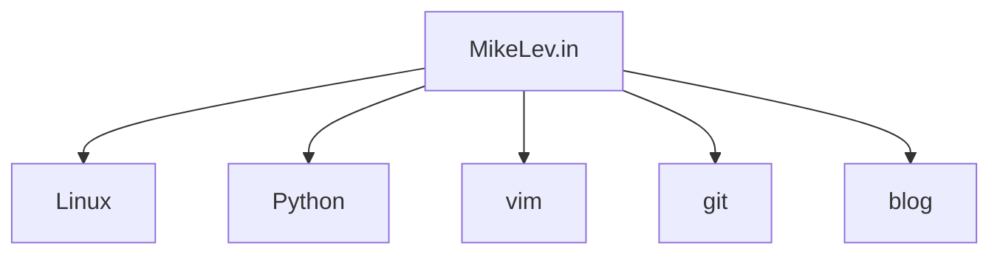

Okay, what specific measures am I going to take now in light of Best Foot
Forward SEO? Well, the actual single one-and-only homepage address of a site is
even more important than ever. It's the one URL that will basically never
change. Hang as many signals as to what your site is about... what YOU are
about... off of that. Hmmm, I should make my homepage of MikeLev.in loaded
right along with my journals and .vimrc in my /usr/local/sbin/all script. Yes!
Maybe it will be 2nd to last.

Okay, I sudo vim'd my /usr/local/sbin/all program. I should be able to just
quit vim and reload it and my main site homepage will be my :blast file in my
buffer. I say :blast because that's the keyboard command that would bring me to
it, although :bl would do it just a well. But I find it a blast to :blast my
way to my most important file... wow, tested and it works. My main homepage
will be kept much more up to date than usual. I will indeed be putting my best
foot forward. I am no longer locked in that static state.

Let's get a simple mermaid diagram onto the homepage. First test it here using
the example from the github pages docs:

## Testing Mermaid Diagrams on Github Pages

And this is another test...

Here's the page that [documents the mermaid system](https://mermaid-js.github.io/)

Okay, the work

## Categories

<ul>
<li><h4><a href='/github-pages/'>Github Pages</a></h4></li>
<li><h4><a href='/seo/'>SEO</a></h4></li></ul>