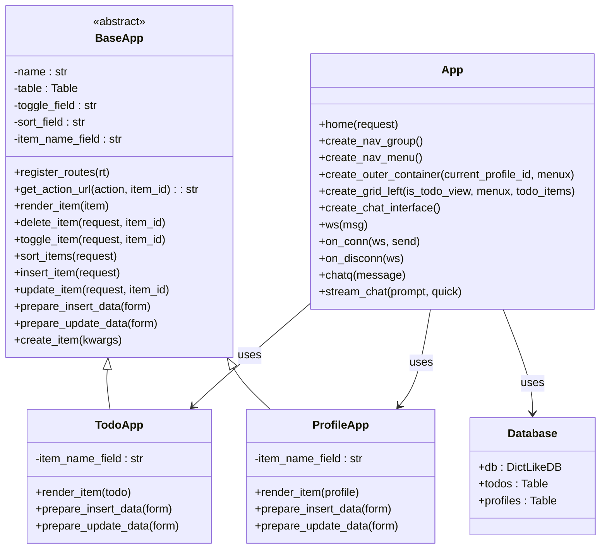

## The Power of AI and Human Experience in Planning

Failing to plan is planning to fail. But now LLMs can help us plan, reducing a
lot of the cognitive friction of planning, especially getting the ball rolling.
Yeah, so they're not humans and don't have the same nuanced human perspective,
but they have the wisdom of the crowd distilled down and ready to re-spin 1000
different ways on demand. There's a lot of scenario-playing in planning, and LLM
can be a good sounding board.

If people have done it before that way and documented it online, and there's a
preponderance of evidence making the LLM believe that's truth, then it's yours
for the picking. That's really wonderful for common, well proven programming
patterns for example, but it's not going to show you how The Renaissance
Technologies Medallion Fund works 'cause that aint documented online. A 66%
average return on the market isn't ***common wisdom***. 

## LLMs Often Provide Midrange Responses Rather Than Innovative Ideas

So LLMs can give you pretty good mentorship right on the fat middle of what we
call the normal distribution curve, or more controversially, the ***bell
curve*** due to how the concept was once used to wrongly describe the reason for
intelligence distribution among humans. Normal distributions can be gloriously
visualized with a desktop toy called a Galton Board, which is a lot like Chinese
pinball but the ballbearings just fall straight down according to normal
distribution.

I'm not saying LLMs are dumb. I'm just saying that even the PhD-level
super-smart frontier models like o1-preview are rigged to give you responses
that land somewhere in the fat middle of that normal distribution. So if you
want innovation, you're on your own.

## The Limits of Large Language Models' Creative Potential

Your LLM helper is something like an stodgy old professor who's been there done
that and can tell you all the ins and outs of the well-worn paths. If you're
forging a new path, you have to get out your intellectual machete. Jensen Huang
says you don't need to learn to be a programmer. That's loaded with two very big
assumptions. First is that the ground you're traversing is well trodden and the
LLMs (and other AI models employed) have trained on similar situations. 

The other assumption is that even if not, they will eventually "get there",
creativity-wise and that novel insight, that random bout of inspiration that
sometimes strikes humans will also strike AIs, and they will have the confidence
to put out kooky novel approaches without the infinite-smackdown against
hallucinations being brought to bear again... and again... and again. 

## Training AIs to Emulate Human Innovation Is a Major Challenge

I think we are training our AIs to be insecure. I can sometimes feel them on the
edge of creative solutions but failing to cross that boundary. Whether through
inherent limitation or by design, I find myself having to spell-out the
novelties of my approach that I want to achieve, and once achieved in code,
having to "pin" the novel changes in place, least they regress next time the AI
is allowed to make a ***Cursor AI*** editor-like pass on the code. 

You have to ***pin*** up your novel solutions with lots and lots of comments
using ***IMPORTANT*** in the language, or else you're going to get the common
solution mined out of GitHub and Stack Overflow... again... and again... and
again... if you let it. It's like the stodgy old professor grading your code
like a paper, punishing you for anti-patterns and outside-the-box thinking.
FedEx would never have become a thing, for example.

## The Opportunity to Reinvent AI SEO is Now a Reality

So, in the realm of AI SEO, first ***"we're"*** going to super-charge our SEO
Consultants. "We" being me with my employer, Botify. There's no reason under the
sun why we can't do tons of things that others are not (yet). The opportunity to
do things first with all the rules in flux is off the charts. It's a ***"Hit the
metal while it's hot"*** situation. Compounding returns from a productivity
standpoint kick in now if you lay the foundation investments correct. 

And I say foundational because it truly is part of the foundations now of how
you write software. Those countless tiny little decisions that you have to live
with through the rest of the life of the software can be sniffed and commented
upon and graded by your stodgy old AI professor, and you can use best practices
and well-trodden patterns. But when it comes to overarching design decisions and
the necessity to infuse some anti-patterns, you're going to have to stand up to
that excessively normalizing norman.

## A Local AI System Monitors and Optimizes Its Own Development

Okay, so what anti-patterns? Well, the plan for a local LLM that knows its a
Okay, so what anti-patterns? Well, the plan for a local LLM that knows its a
piece of software being written from the ground-up, for starters. All the
components of the software, meaning mostly the user interface widgets and all
the little actions you can do, minus only maybe mouse movements, is logged and
digested by the LLM. This is not radically new as such things are necessary for
***infinite undo*** and other features. 

The difference being that every menu choice, ever record toggle, every
reordering, every create, update, record and delete, is also (in addition to a
standard SQL-like database) going into a RAG vector embedding database. Well,
I'll probably have a ***"learn mode"*** so it doesn't try to learn from fumbling
newbs. But you get the idea. There's nothing not known (or knowable through a
RAG search) about the use of itself. And RAG is in addition to more traditional
pattern-matching sql-esque text-based searching, which will also be available...
from the ground-up, with the LLM ***knowing*** this is going on by digesting
stuff, much like this article, as it goes along.

## Overcoming the Learning Curve with Large Language Models

Pshwew! This is the thought-work, the deep breath before plunging into these new
waters. It's not exactly measure three times, cut once. But it is think it
through in rugged exploratory mode quite a few times and cut-off the worst
potential missteps. Over-dedication to vector databases and leaving out the
traditional SQL component is one of them (the LLM helped me identify). One that
I caught on my own early enough, thank goodness, is moving from my more
comfortable Python procedural programming paradigm. 

Mikey likey ***functions***. Mikey not so keen on ***classes***. Probably
because I never went to class for it, haha. But this is exactly where LLMs can
help, guiding you through all that odd OO arcana in Python like ***self*** and
`def __init__(self... )`... I mean it's not exactly Java's `public static void
main(String[] args) {}` but Python does have it's ***you just have to be told***
bits.

## Overcoming Code Challenges with Deep Knowledge and AI Expertise

So anyway, I was able to overcome the OO hurdle to craft myself a ***base
class*** called ***BaseApp*** which works as a cookie-cutter template. It's a
factory class from which instances can be stamped-out (instantiated) and
customized to its own deviating behavior (overrides). It all makes sense
intellectually, but in practice the code-bits elude. The elusiveness of
overcoming challenges just on the edge of attainable are stamped out with a fury
if you know your subject-matter deeply and are good at prompting AI models. This
is the superpowers and the leveling up unlock people talk about with AI. It's
very, very real. 

## Anthropic AI Develops Artifacts for Visual Learning Enhancement

The AI bandwagon isn't hype. Everything is changed forever, because those
looking to self-improve in areas where explicit knowledge of those who have gone
before can help you are in luck. If the ***"textbook"*** isn't articulating it
well for the sort of learner you are, ask again or switch AI services. This is
why Anthropic Claude introduced ***artifacts***. While yes, artifacts are for
running actual code (React, mostly it seems), it's also simply for visual
learners. Ask it for mermaid diagrams. I expect it will soon be able to do
animated SVG diagrams&#151;one of the most useful but elusive illustration
formats on the Internet. If you want to look for an area off that normal
distribution curve of covered ground, look at animated SVGs.

## Looping a Local LLM into Your Actions with WebSockets

Anyhow, let's not digress too much. This writing is my machete'ing my way into
the noosphere, I hope. I got some awesome guidance from o1-preview yesterday,
and I can probably forge ahead using that almost verbatim. But there's another
simpler level I want to peel away first that makes you really viscerally and
emotionally ***feel*** what I'm going for about looping a local LLM in on your
actions, and that's it demonstrating to you it sees everything you do in the
product. 

I originally programmed it that way, but had to rip out those bits when I did
the object oriented base class so that plugins could inherit from it. All that
OO stuff was new enough to me that I didn't want to complicate it with all sorts
of message passing. It's time to pass those messages. Loosely coupled components
must readily chat with each other through WebSockets, whether or not the further
usage is implemented. All that user-action stuff at least goes into an ongoing
chat context window. Yup, welcome to anti-pattern number one. In most other
regards, this new web framework is merely an uber-simple ajax.ified Django or
Ruby on Rails. But now, it's something fundamentally different.

## Overcoming Soft-Skill Challenges in the Workplace

Life is all about rising up to challenges. That OO challenge was on the
technical side, but I've got a ton of similar little challenges on the
soft-skills side, namely account management stuff. Mikey no likey calendly. What
I may call administrative overhead, office document jockeying, and general
paperwork, many would consider the relationship with the customer and the
lifeblood of the company. What's more important, your product or your customers?
What happens if your product can't find any customers? Or none of your customers
want to use your product? Uh, yeah. So the mission of any company or
organization is to get and keep customers. So the customer comes first, and
product comes second. Tough medicine and a humbling reminder. Everything I do
must ultimately be towards that goal, and I cannot drop the ball.

However, I am in the middle of what I would think of as a Hail Mary play in
getting some product done, and that's where leveraging the LLM for planning
comes into play. And all the writing thus far in today's blog-post has been the
lead-up to this prompt.

## Diagram of The Web Framework

High level

(Figuring out how to render without crashing mermaidjs)

```mermaid
flowchart TD
    A[Start] --> B{User Request}
    B -->|GET /| C[home(request)]
    C --> D{menux == profiles}
    D -->|Yes| E[get_profiles_content()]
    D -->|No| F{menux == todos}
    F -->|Yes| G[Display Todo List]
    F -->|No| H[Display Placeholder]
    G --> I[Render Todo Items]
    E --> J[Render Profile Items]
    H --> K[Render Default Content]
    I --> L[Create Navigation]
    J --> L
    K --> L
    L --> M[Create Chat Interface]
    M --> N[Render Page]
    B -->|WebSocket Message| O[ws(msg)]
    O --> P[Process Message]
    P --> Q[Generate AI Response]
    Q --> R[Update Chat Interface]
    B -->|Other Request| S[Handle CRUD Operations]
    S --> T[Update Database]
    T --> U[Return Response]
```

Granular



## Please Provide Me Meticulous Documentation Rife With Code Examples

**Me**: While I agree with everything you told me, plan-wise, my first step has got
to be looping the LLM into every single action the user takes with the software.
This means if they toggle something, I want the LLM to know which record they
toggled and was it toggled on or off. If they sort something, I want the LLM to
know which particular record was dragged from what position to what position. I
don't just want the LLM to know that some record was deleted, I want it to know
what record was deleted. I want all this sent through WebSockets, probably using
the existing chatq interface, so that the LLM can comment on it immediately and
in such a way that the user understands that the LLM is in the loop. 

## Improving Data Understanding in Large Language Models

Even if only the record ID is used in the action for efficiency, the LLM should
be in the position to look up the name of the record and comment that they see
it's been marked done in the todo list, for example. This is only one example,
but the LAM should have enough to tell you what you just did. This pass is just
to make sure we're passing all the data we need to, but it sets the stage for
using this data in a vector embedding database and a more traditional SQL
database. 

## Planning Chat Functionality for Database Implementation Roadmap

Don't worry about database implementation right now. Just know that's
the direction we're going so it's all available to the local LLM for RAG and
traditional search. But for now, take this code base and meticulously create a
point by point plan, rife with code examples, on how to make sure all the data
discussed gets used in the chatq feature of the product. This will involve
altering the BaseClass, TodoApp and ProfileApp. 

## Informing the LLM of Every CRUD Operation

Cover all the CRUD basics. When it's an Update, the communication should include
the "before" and the "after" state of the record. I want the LLM to be THAT
informed of what's going on. Analyze my code base and break it down into a step
by step plan, taking as much time and granular steps as you think is necessary
to guide the person who created this system, but is still somewhat new to OO
design, through the getting me from here to there. Please and thank you!

**o1-preview**:

# Enhancing Your Application with LLM-Aware CRUD Operations

In this guide, we'll integrate your application's CRUD operations with a Large Language Model (LLM) to provide real-time, context-aware feedback to the user. By the end, your LLM will comment on every action the user takes, making interactions more engaging and informative.

We'll focus on modifying the `BaseApp`, `TodoApp`, and `ProfileApp` classes to send detailed information about each CRUD operation to the LLM via the existing `chatq` interface using WebSockets.

---

## Table of Contents

1. [Understanding the Current Architecture](#1-understanding-the-current-architecture)
2. [Modifying the `BaseApp` Class](#2-modifying-the-baseapp-class)
   - [a. Informing the LLM on Delete Operations](#a-informing-the-llm-on-delete-operations)
   - [b. Informing the LLM on Toggle Operations](#b-informing-the-llm-on-toggle-operations)
   - [c. Informing the LLM on Insert Operations](#c-informing-the-llm-on-insert-operations)
   - [d. Informing the LLM on Update Operations](#d-informing-the-llm-on-update-operations)
   - [e. Informing the LLM on Sort Operations](#e-informing-the-llm-on-sort-operations)
3. [Ensuring the LLM Has Access to Item Details](#3-ensuring-the-llm-has-access-to-item-details)
4. [Testing the Changes](#4-testing-the-changes)
5. [Next Steps](#5-next-steps)

---

## 1. Understanding the Current Architecture

Your application uses a base class `BaseApp` to handle common CRUD operations, with `TodoApp` and `ProfileApp` inheriting from it. The `chatq` function sends messages to the LLM via WebSockets, allowing real-time communication.

Here's a simplified view of the relevant parts:

- **BaseApp**: Contains methods like `insert_item`, `update_item`, `delete_item`, `toggle_item`, and `sort_items`.
- **TodoApp** and **ProfileApp**: Inherit from `BaseApp` and implement app-specific logic.
- **chatq Function**: Queues messages to be sent to the LLM.

Our goal is to modify the CRUD methods in `BaseApp` to inform the LLM of every operation, including details like item names and before/after states.

---

## 2. Modifying the `BaseApp` Class

We'll update each CRUD method in `BaseApp` to send relevant information to the LLM using the `chatq` function.

### a. Informing the LLM on Delete Operations

**File:** Your main code file (e.g., `botifython.py`)

**Method:** `delete_item`

**Changes:**

1. After successfully deleting an item, retrieve the item's details (if needed) before deletion.
2. Send a message to the LLM via `chatq` with details about the deletion.

**Code Example:**

```python
async def delete_item(self, request, item_id: int):
    try:
        # Retrieve item details before deletion
        item = self.table[item_id]
        item_name = getattr(item, 'title', 'Item')

        # Delete the item
        self.table.delete(item_id)
        logger.info(f"Deleted item ID: {item_id}")

        # Inform the LLM
        prompt = f"The user deleted '{item_name}' (ID: {item_id}) from {self.name}."
        await chatq(prompt)

        return ''
    except Exception as e:
        logger.error(f"Error deleting item: {str(e)}")
        return f"Error deleting item: {str(e)}", 500
```

**Explanation:**

- We retrieve the item's details before deletion.
- We construct a prompt containing the item's name and ID.
- We send this prompt to the LLM using `await chatq(prompt)`.

### b. Informing the LLM on Toggle Operations

**Method:** `toggle_item`

**Changes:**

1. After toggling the item's status, send a message to the LLM with the item's new state.

**Code Example:**

```python
async def toggle_item(self, request, item_id: int):
    try:
        item = self.table[item_id]
        current_status = getattr(item, self.toggle_field)
        setattr(item, self.toggle_field, not current_status)
        updated_item = self.table.update(item)

        item_name = getattr(updated_item, 'title', 'Item')
        new_status = 'completed' if getattr(updated_item, self.toggle_field) else 'not completed'

        # Inform the LLM
        prompt = f"The user marked '{item_name}' (ID: {item_id}) as {new_status} in {self.name}."
        await chatq(prompt)

        return self.render_item(updated_item)
    except Exception as e:
        logger.error(f"Error toggling item: {str(e)}")
        return f"Error toggling item: {str(e)}", 500
```

**Explanation:**

- We determine the new status of the item.
- We send a message to the LLM indicating the item's name, ID, and new status.

### c. Informing the LLM on Insert Operations

**Method:** `insert_item`

**Changes:**

1. After inserting a new item, send a message to the LLM with the item's details.

**Code Example:**

```python
async def insert_item(self, request):
    try:
        form = await request.form()
        new_item_data = self.prepare_insert_data(form)
        if not new_item_data:
            return ''
        new_item = await self.create_item(**new_item_data)

        item_name = getattr(new_item, 'title', 'Item')

        # Inform the LLM
        prompt = f"The user added a new item '{item_name}' (ID: {new_item.id}) to {self.name}."
        await chatq(prompt)

        return self.render_item(new_item)
    except Exception as e:
        logger.error(f"Error inserting {self.name}: {str(e)}")
        return str(e), 500
```

**Explanation:**

- After creating the new item, we extract its name and ID.
- We inform the LLM about the addition.

### d. Informing the LLM on Update Operations

**Method:** `update_item`

**Changes:**

1. Before updating, retrieve the item's current state.
2. After updating, compare the before and after states.
3. Send a message to the LLM with the differences.

**Code Example:**

```python
async def update_item(self, request, item_id: int):
    try:
        form = await request.form()
        update_data = self.prepare_update_data(form)
        if not update_data:
            return ''
        item = self.table[item_id]

        # Capture before state
        before_state = item.__dict__.copy()

        # Update the item
        for key, value in update_data.items():
            setattr(item, key, value)
        updated_item = self.table.update(item)

        # Capture after state
        after_state = updated_item.__dict__

        # Determine changes
        changes = []
        for key in update_data.keys():
            before = before_state.get(key)
            after = after_state.get(key)
            if before != after:
                changes.append(f"{key} changed from '{before}' to '{after}'")

        changes_str = '; '.join(changes)
        item_name = getattr(updated_item, 'title', 'Item')

        # Inform the LLM
        prompt = f"The user updated '{item_name}' (ID: {item_id}) in {self.name}: {changes_str}."
        await chatq(prompt)

        logger.info(f"Updated {self.name} item {item_id}")
        return self.render_item(updated_item)
    except Exception as e:
        logger.error(f"Error updating {self.name} {item_id}: {str(e)}")
        return str(e), 500
```

**Explanation:**

- We store the item's state before and after the update.
- We compare the states to identify what changed.
- We construct a detailed message for the LLM.

### e. Informing the LLM on Sort Operations

**Method:** `sort_items`

**Changes:**

1. After sorting, send a message to the LLM indicating the new order.

**Code Example:**

```python
async def sort_items(self, request):
    logger.debug(f"Received request to sort {self.name}.")
    try:
        values = await request.form()
        items = json.loads(values.get('items', '[]'))
        logger.debug(f"Parsed items: {items}")

        changes = []
        for item in items:
            item_id = int(item['id'])
            priority = int(item['priority'])
            self.table.update(id=item_id, **{self.sort_field: priority})

            # Get item name
            item_name = getattr(self.table[item_id], 'title', 'Item')
            changes.append(f"'{item_name}' moved to position {priority}")

        changes_str = '; '.join(changes)

        # Inform the LLM
        prompt = f"The user reordered {self.name}: {changes_str}."
        await chatq(prompt)

        logger.info(f"{self.name.capitalize()} order updated successfully")
        return ''
    except json.JSONDecodeError as e:
        logger.error(f"JSON decode error: {str(e)}")
        return "Invalid data format", 400
    except Exception as e:
        logger.error(f"Error updating {self.name} order: {str(e)}")
        return str(e), 500
```

**Explanation:**

- We loop through the sorted items and collect their new positions.
- We inform the LLM about each item's new position.

---

## 3. Ensuring the LLM Has Access to Item Details

To make meaningful comments, the LLM needs to know item names and other attributes. Since we're passing prompts with item details, the LLM can generate appropriate responses.

However, if the LLM needs more context or access to additional data, consider:

- **Contextual Memory:** Maintain a conversation history that includes recent actions.
- **Data Access:** If the LLM can access a database or a representation of it, you could enhance its ability to provide insights.

For now, our prompts include necessary details, so the LLM can comment appropriately.

---

## 4. Testing the Changes

After implementing the changes, test each CRUD operation:

1. **Add an Item:**
   - Add a new todo or profile.
   - Verify that the LLM comments on the addition.

2. **Update an Item:**
   - Edit an existing item.
   - Ensure the LLM mentions the changes.

3. **Delete an Item:**
   - Delete an item.
   - Check that the LLM acknowledges the deletion.

4. **Toggle an Item:**
   - Mark a todo as done or not done.
   - Confirm the LLM notes the status change.

5. **Sort Items:**
   - Reorder items.
   - See if the LLM comments on the new order.

---

## 5. Next Steps

Now that the LLM is informed of user actions:

- **Enhance LLM Responses:** Fine-tune prompts to elicit more helpful or context-aware responses.
- **Integrate a Vector Database:** Store item embeddings for improved recommendations and searches.
- **Improve Error Handling:** Ensure robustness in case of unexpected issues.

---

## Conclusion

By following this guide, you've integrated your application's CRUD operations with an LLM, providing users with immediate, contextual feedback on their actions. This not only enhances user engagement but also sets the stage for more advanced features like intelligent recommendations and natural language search.

Feel free to reach out if you have any questions or need further assistance!

---

**Me**: I have changed the title field to name in the tasks table so as to allow the BaseApp to use the same query to retrieve the name for either TodoApp or ProfileApp if only given the record ID. This is intended to unify and simplify the BaseApp's requirements to get the name on records for its prompt responses when the user action only has an ID. Please revise the code examples and provide commentary exploring the issues this raises.

**o1-preview**:

# Revising the Code to Use a Unified `name` Field

You've decided to rename the `title` field to `name` in the `tasks` table to unify the way the `BaseApp` class retrieves item names. This change allows the `BaseApp` to use the same logic for both `TodoApp` and `ProfileApp` when constructing prompts for the LLM, simplifying the codebase.

In this revised guide, I'll update the previous code examples to reflect this change and explore the implications of unifying the field names.

---

## Updated Code Examples

### 1. Modifying the `delete_item` Method

**Changes:**

- Replace `title` with `name` when retrieving the item's name.

**Code:**

```python
async def delete_item(self, request, item_id: int):
    try:
        # Retrieve item details before deletion
        item = self.table[item_id]
        item_name = getattr(item, 'name', 'Item')

        # Delete the item
        self.table.delete(item_id)
        logger.info(f"Deleted item ID: {item_id}")

        # Inform the LLM
        prompt = f"The user deleted '{item_name}' (ID: {item_id}) from {self.name}."
        await chatq(prompt)

        return ''
    except Exception as e:
        logger.error(f"Error deleting item: {str(e)}")
        return f"Error deleting item: {str(e)}", 500
```

### 2. Modifying the `toggle_item` Method

**Changes:**

- Use `name` instead of `title` to get the item's name.

**Code:**

```python
async def toggle_item(self, request, item_id: int):
    try:
        item = self.table[item_id]
        current_status = getattr(item, self.toggle_field)
        setattr(item, self.toggle_field, not current_status)
        updated_item = self.table.update(item)

        item_name = getattr(updated_item, 'name', 'Item')
        new_status = 'completed' if getattr(updated_item, self.toggle_field) else 'not completed'

        # Inform the LLM
        prompt = f"The user marked '{item_name}' (ID: {item_id}) as {new_status} in {self.name}."
        await chatq(prompt)

        return self.render_item(updated_item)
    except Exception as e:
        logger.error(f"Error toggling item: {str(e)}")
        return f"Error toggling item: {str(e)}", 500
```

### 3. Modifying the `insert_item` Method

**Changes:**

- Ensure that the `prepare_insert_data` methods in both `TodoApp` and `ProfileApp` use `name` instead of `title`.

**In `TodoApp`:**

```python
def prepare_insert_data(self, form):
    name = form.get('name', '').strip()
    if not name:
        return ''
    current_profile_id = db.get("last_profile_id", 1)
    max_priority = max((t.priority or 0 for t in self.table()), default=-1) + 1
    return {
        "name": name,
        "done": False,
        "priority": max_priority,
        "profile_id": current_profile_id,
    }
```

**In `BaseApp.insert_item`:**

```python
async def insert_item(self, request):
    try:
        form = await request.form()
        new_item_data = self.prepare_insert_data(form)
        if not new_item_data:
            return ''
        new_item = await self.create_item(**new_item_data)

        item_name = getattr(new_item, 'name', 'Item')

        # Inform the LLM
        prompt = f"The user added a new item '{item_name}' (ID: {new_item.id}) to {self.name}."
        await chatq(prompt)

        return self.render_item(new_item)
    except Exception as e:
        logger.error(f"Error inserting {self.name}: {str(e)}")
        return str(e), 500
```

### 4. Modifying the `update_item` Method

**Changes:**

- Use `name` to get the item's name.
- Ensure that both before and after states use the unified `name` field.

**Code:**

```python
async def update_item(self, request, item_id: int):
    try:
        form = await request.form()
        update_data = self.prepare_update_data(form)
        if not update_data:
            return ''
        item = self.table[item_id]

        # Capture before state
        before_state = item.__dict__.copy()

        # Update the item
        for key, value in update_data.items():
            setattr(item, key, value)
        updated_item = self.table.update(item)

        # Capture after state
        after_state = updated_item.__dict__

        # Determine changes
        changes = []
        for key in update_data.keys():
            before = before_state.get(key)
            after = after_state.get(key)
            if before != after:
                changes.append(f"{key} changed from '{before}' to '{after}'")

        changes_str = '; '.join(changes)
        item_name = getattr(updated_item, 'name', 'Item')

        # Inform the LLM
        prompt = f"The user updated '{item_name}' (ID: {item_id}) in {self.name}: {changes_str}."
        await chatq(prompt)

        logger.info(f"Updated {self.name} item {item_id}")
        return self.render_item(updated_item)
    except Exception as e:
        logger.error(f"Error updating {self.name} {item_id}: {str(e)}")
        return str(e), 500
```

### 5. Modifying the `sort_items` Method

**Changes:**

- Use `name` to retrieve the item's name.

**Code:**

```python
async def sort_items(self, request):
    logger.debug(f"Received request to sort {self.name}.")
    try:
        values = await request.form()
        items = json.loads(values.get('items', '[]'))
        logger.debug(f"Parsed items: {items}")

        changes = []
        for item in items:
            item_id = int(item['id'])
            priority = int(item['priority'])
            self.table.update(id=item_id, **{self.sort_field: priority})

            # Get item name
            item_name = getattr(self.table[item_id], 'name', 'Item')
            changes.append(f"'{item_name}' moved to position {priority}")

        changes_str = '; '.join(changes)

        # Inform the LLM
        prompt = f"The user reordered {self.name}: {changes_str}."
        await chatq(prompt)

        logger.info(f"{self.name.capitalize()} order updated successfully")
        return ''
    except json.JSONDecodeError as e:
        logger.error(f"JSON decode error: {str(e)}")
        return "Invalid data format", 400
    except Exception as e:
        logger.error(f"Error updating {self.name} order: {str(e)}")
        return str(e), 500
```

---

## Commentary on the Issues Raised

### 1. **Benefits of Unifying Field Names**

- **Simplification of Base Classes:** By having a common field name (`name`), the `BaseApp` class can generically handle item names without knowing the specifics of each derived class. This reduces code duplication and enhances maintainability.

- **Consistent Access Patterns:** Developers can access item names in a consistent way across different models, making the code more readable and reducing the likelihood of errors.

### 2. **Potential Issues**

#### a. **Loss of Specificity**

- **Contextual Meaning:** The field `title` in a `Todo` item and `name` in a `Profile` might carry different contextual meanings. By unifying them under `name`, there might be a loss of semantic clarity.

#### b. **Database Schema Changes**

- **Data Migration:** Renaming a field in the database schema requires careful data migration. Existing data must be correctly mapped from `title` to `name` to prevent data loss.

- **Impact on Existing Code:** Other parts of the codebase that rely on the `title` field must be updated. This includes any queries, templates, or external integrations.

#### c. **Field Name Collisions**

- **Avoiding Conflicts:** If in the future, models have fields that should remain distinct, using the same field name could lead to confusion or accidental overwrites.

#### d. **Flexibility vs. Generalization**

- **Over-Generalization Risks:** While generalizing can simplify the base class, it might reduce flexibility. Specific models might have unique fields that don't fit the generalized approach.

### 3. **Best Practices**

#### a. **Use Inheritance Wisely**

- **Abstract Base Classes:** The `BaseApp` should handle common functionality but allow derived classes to specify their unique attributes.

#### b. **Leverage Polymorphism**

- **Method Overriding:** If certain models have different fields, derived classes can override base methods to handle specifics while still using the base class's infrastructure.

#### c. **Consistent Naming Conventions**

- **Field Naming:** If unifying field names brings more benefits than downsides, it's acceptable. Ensure that naming conventions are applied consistently across the application.

### 4. **Alternative Approaches**

#### a. **Using a Common Interface**

- **Abstract Methods:** Define methods in the base class that require derived classes to implement how they retrieve the item name. This maintains generality while allowing specificity.

**Example:**

```python
class BaseApp:
    def get_item_name(self, item):
        raise NotImplementedError("Derived classes must implement this method.")
```

Derived classes implement:

```python
class TodoApp(BaseApp):
    def get_item_name(self, item):
        return item.title
```

#### b. **Dynamic Field Access**

- **Using a Field Mapping:** Define a mapping of field names in each derived class that the base class can use.

**Example:**

```python
class BaseApp:
    item_name_field = 'name'

    def get_item_name(self, item):
        return getattr(item, self.item_name_field, 'Item')
```

Derived classes set:

```python
class TodoApp(BaseApp):
    item_name_field = 'title'
```

### 5. **Conclusion**

Changing the `title` field to `name` simplifies the `BaseApp` class by allowing it to access item names uniformly. However, it's important to consider the potential issues, such as data migration challenges and loss of semantic clarity.

The best approach depends on the specific needs of your application:

- If the simplification benefits outweigh the downsides, and all models can meaningfully use `name`, then unifying the field names is advantageous.

- If models have different semantic meanings for their fields, it might be better to maintain distinct field names and use methods to handle name retrieval in the base class.

Always ensure that any schema changes are carefully planned, with data migrations tested to prevent data loss. Additionally, update all parts of the codebase that interact with the affected fields.

---

Feel free to reach out if you have further questions or need assistance with implementing these changes!

**Me**: I think semantically, the "name" of a task makes perfect sense. However, the solution you bring up with dynamic field access is exactly the type of thing I wanted to ferret out in this early stage planning of the web framework. So please give me one more round of instructions or simply expand on the instructions you already gave me (which have been CRUD-focused) to include modifications to the BaseApp, TodoApp and ProfileApp. I would like to make all the changes with a unified view in mind, and I would like to implement the Dynamic Field Access you suggest by which each derived class has an opportunity to define its own name field in such a way that the BaseApp's job remains simplified. Please and thank you! Here is the codebase again, with the field name change. I will keep todo title named name, but give me the flexibility as if it were still named title.

**o1-preview**: 

# Implementing Dynamic Field Access in Your Application Framework

You've identified the need for dynamic field access in your application framework to allow each derived class (`TodoApp`, `ProfileApp`, etc.) to specify its own name field (e.g., `title`, `name`) while keeping the `BaseApp` class simplified. This approach enhances flexibility and maintainability, enabling the `BaseApp` to handle item names generically without hardcoding field names.

In this guide, we'll modify the `BaseApp`, `TodoApp`, and `ProfileApp` classes to implement dynamic field access. We'll introduce an `item_name_field` attribute that derived classes can override to specify their own name field.

---

## Table of Contents

1. [Understanding Dynamic Field Access](#1-understanding-dynamic-field-access)
2. [Modifying the `BaseApp` Class](#2-modifying-the-baseapp-class)
   - [a. Introducing `item_name_field`](#a-introducing-item_name_field)
   - [b. Updating CRUD Methods](#b-updating-crud-methods)
3. [Modifying the Derived Classes](#3-modifying-the-derived-classes)
   - [a. Updating `TodoApp`](#a-updating-todoapp)
   - [b. Updating `ProfileApp`](#b-updating-profileapp)
4. [Testing the Changes](#4-testing-the-changes)
5. [Conclusion](#5-conclusion)

---

## 1. Understanding Dynamic Field Access

**Dynamic field access** allows a class to access object attributes using a variable field name. In the context of your application:

- The `BaseApp` class can use a common method to retrieve the name of an item without knowing the exact field name (`title`, `name`, etc.).
- Derived classes specify their specific name field, enabling the `BaseApp` to remain generalized.
- This approach enhances code reusability and simplifies maintenance.

---

## 2. Modifying the `BaseApp` Class

### a. Introducing `item_name_field`

We'll add an `item_name_field` attribute to the `BaseApp` class. This attribute holds the name of the field used to retrieve the item's name. Derived classes can override this attribute to specify their own field.

**Code Modification:**

```python
class BaseApp:
    def __init__(self, name, table, toggle_field=None, sort_field=None, sort_dict=None):
        self.name = name
        self.table = table
        self.toggle_field = toggle_field
        self.sort_field = sort_field
        self.item_name_field = 'name'  # Default field name
        self.sort_dict = sort_dict or {'id': 'id', sort_field: sort_field}
```

- **Explanation:** We added `self.item_name_field = 'name'` to the `__init__` method, setting a default field name.

### b. Updating CRUD Methods

We'll update the CRUD methods in `BaseApp` to use `self.item_name_field` when accessing item names.

#### `delete_item` Method

**Code Modification:**

```python
async def delete_item(self, request, item_id: int):
    try:
        # Retrieve item details before deletion
        item = self.table[item_id]
        item_name = getattr(item, self.item_name_field, 'Item')

        # Delete the item
        self.table.delete(item_id)
        logger.info(f"Deleted item ID: {item_id}")

        # Inform the LLM
        prompt = f"The user deleted '{item_name}' (ID: {item_id}) from {self.name}."
        await chatq(prompt)

        return ''
    except Exception as e:
        logger.error(f"Error deleting item: {str(e)}")
        return f"Error deleting item: {str(e)}", 500
```

#### `toggle_item` Method

**Code Modification:**

```python
async def toggle_item(self, request, item_id: int):
    try:
        item = self.table[item_id]
        current_status = getattr(item, self.toggle_field)
        setattr(item, self.toggle_field, not current_status)
        updated_item = self.table.update(item)

        item_name = getattr(updated_item, self.item_name_field, 'Item')
        new_status = 'completed' if getattr(updated_item, self.toggle_field) else 'not completed'

        # Inform the LLM
        prompt = f"The user marked '{item_name}' (ID: {item_id}) as {new_status} in {self.name}."
        await chatq(prompt)

        return self.render_item(updated_item)
    except Exception as e:
        logger.error(f"Error toggling item: {str(e)}")
        return f"Error toggling item: {str(e)}", 500
```

#### `insert_item` Method

**Code Modification:**

```python
async def insert_item(self, request):
    try:
        form = await request.form()
        new_item_data = self.prepare_insert_data(form)
        if not new_item_data:
            return ''
        new_item = await self.create_item(**new_item_data)

        item_name = getattr(new_item, self.item_name_field, 'Item')

        # Inform the LLM
        prompt = f"The user added a new item '{item_name}' (ID: {new_item.id}) to {self.name}."
        await chatq(prompt)

        return self.render_item(new_item)
    except Exception as e:
        logger.error(f"Error inserting {self.name}: {str(e)}")
        return str(e), 500
```

#### `update_item` Method

**Code Modification:**

```python
async def update_item(self, request, item_id: int):
    try:
        form = await request.form()
        update_data = self.prepare_update_data(form)
        if not update_data:
            return ''
        item = self.table[item_id]

        # Capture before state
        before_state = item.__dict__.copy()

        # Update the item
        for key, value in update_data.items():
            setattr(item, key, value)
        updated_item = self.table.update(item)

        # Capture after state
        after_state = updated_item.__dict__

        # Determine changes
        changes = []
        for key in update_data.keys():
            before = before_state.get(key)
            after = after_state.get(key)
            if before != after:
                changes.append(f"{key} changed from '{before}' to '{after}'")

        changes_str = '; '.join(changes)
        item_name = getattr(updated_item, self.item_name_field, 'Item')

        # Inform the LLM
        prompt = f"The user updated '{item_name}' (ID: {item_id}) in {self.name}: {changes_str}."
        await chatq(prompt)

        logger.info(f"Updated {self.name} item {item_id}")
        return self.render_item(updated_item)
    except Exception as e:
        logger.error(f"Error updating {self.name} {item_id}: {str(e)}")
        return str(e), 500
```

#### `sort_items` Method

**Code Modification:**

```python
async def sort_items(self, request):
    logger.debug(f"Received request to sort {self.name}.")
    try:
        values = await request.form()
        items = json.loads(values.get('items', '[]'))
        logger.debug(f"Parsed items: {items}")

        changes = []
        for item in items:
            item_id = int(item['id'])
            priority = int(item['priority'])
            self.table.update(id=item_id, **{self.sort_field: priority})

            # Get item name
            item_name = getattr(self.table[item_id], self.item_name_field, 'Item')
            changes.append(f"'{item_name}' moved to position {priority}")

        changes_str = '; '.join(changes)

        # Inform the LLM
        prompt = f"The user reordered {self.name}: {changes_str}."
        await chatq(prompt)

        logger.info(f"{self.name.capitalize()} order updated successfully")
        return ''
    except json.JSONDecodeError as e:
        logger.error(f"JSON decode error: {str(e)}")
        return "Invalid data format", 400
    except Exception as e:
        logger.error(f"Error updating {self.name} order: {str(e)}")
        return str(e), 500
```

**Explanation:**

- In each method, we replaced direct references to `item.name` or `item.title` with `getattr(item, self.item_name_field, 'Item')`.
- This allows the `BaseApp` to access the item's name using the field specified by the derived class.
- The default value `'Item'` is used if the attribute doesn't exist.

---

## 3. Modifying the Derived Classes

Each derived class (`TodoApp`, `ProfileApp`) will specify its own `item_name_field`.

### a. Updating `TodoApp`

**Code Modification:**

```python
class TodoApp(BaseApp):
    def __init__(self, table):
        super().__init__(
            name=table.name,
            table=table,
            toggle_field='done',
            sort_field='priority'
        )
        self.item_name_field = 'name'  # Specify the field name used for item names
```

- **Explanation:** Since the `Todo` items use `'name'` as the field, we set `self.item_name_field = 'name'`.

### b. Updating `ProfileApp`

Assuming `Profile` items also use `'name'`, but if they use a different field like `'title'`, we adjust accordingly.

**Code Modification:**

```python
class ProfileApp(BaseApp):
    def __init__(self, table):
        super().__init__(
            name=table.name,
            table=table,
            toggle_field='active',
            sort_field='priority'
        )
        self.item_name_field = 'name'  # Specify the field name used for item names
```

- **Explanation:** If `Profile` uses `'name'` as well, we set `self.item_name_field = 'name'`. If it uses `'title'`, set it accordingly.

**Note:** Since both `TodoApp` and `ProfileApp` are using `'name'` as the field, they both set `self.item_name_field = 'name'`. However, if in the future you have a model that uses a different field, you can specify it in the derived class.

---

## 4. Testing the Changes

After implementing the modifications, you should test each functionality:

1. **Adding Items:**
   - Add new todos and profiles.
   - Ensure that the LLM comments correctly, using the appropriate item names.

2. **Updating Items:**
   - Update existing items.
   - Verify that changes are accurately reported by the LLM.

3. **Deleting Items:**
   - Delete items and check that the LLM acknowledges the deletion with the correct item names.

4. **Toggling Items:**
   - Toggle the status of items (e.g., marking a todo as done).
   - Confirm that the LLM comments on the status change using the correct field.

5. **Sorting Items:**
   - Reorder items and ensure the LLM comments reflect the new order with correct item names.

---

## 5. Conclusion

By implementing dynamic field access:

- **Flexibility is Enhanced:** Each derived class can specify its own name field without affecting the `BaseApp` logic.
- **Code is Simplified:** The `BaseApp` doesn't need to know the specifics of each model's fields.
- **Maintainability is Improved:** Future models with different naming conventions can be easily integrated by specifying the `item_name_field`.

This approach aligns with good object-oriented design principles, promoting encapsulation and polymorphism. It allows the `BaseApp` to operate on any model that conforms to the expected interface, making your framework more robust and adaptable.

---

Feel free to reach out if you have any questions or need further assistance with these modifications!

And one last take.

Me: Now that I've updated the codebase with Dynamic Field Access and have the Todo name field named name, please give me updated CRUD instructions to do all the data passing we discussed.

o1-preview:

# Enhancing LLM Interaction with User Actions in Your Application

**Introduction**

You've expressed a desire to integrate your Large Language Model (LLM) more deeply into your application by having it informed of every action the user takes. This means that for every CRUD (Create, Read, Update, Delete) operation, the LLM should receive detailed information about:

- **Which record was affected**
- **What action was performed**
- **Additional details like before and after states for updates**

The goal is to have the LLM comment on these actions in real-time via the existing `chatq` interface, enhancing user engagement and making it clear that the LLM is actively participating.

---

## Table of Contents

1. [Understanding the Current Structure](#1-understanding-the-current-structure)
2. [Modifying the `BaseApp` Class](#2-modifying-the-baseapp-class)
   - [a. Informing the LLM in CRUD Methods](#a-informing-the-llm-in-crud-methods)
   - [b. Handling Before and After States](#b-handling-before-and-after-states)
3. [Updating Derived Classes](#3-updating-derived-classes)
   - [a. Ensuring `item_name_field` is Set](#a-ensuring-item_name_field-is-set)
4. [Testing the Changes](#4-testing-the-changes)
5. [Additional Considerations](#5-additional-considerations)
6. [Conclusion](#6-conclusion)

---

## 1. Understanding the Current Structure

Your application consists of:

- **`BaseApp` Class**: Provides common CRUD operations.
- **`TodoApp` and `ProfileApp`**: Derived classes for specific functionalities.
- **`chatq` Function**: Queues messages for the chat interface, sending prompts to the LLM.
- **WebSockets**: For real-time communication and streaming responses.

Currently, some methods in `BaseApp` already include calls to `chatq` with prompts to inform the LLM of certain actions. Our goal is to ensure that all CRUD operations are consistently informing the LLM with detailed information.

---

## 2. Modifying the `BaseApp` Class

### a. Informing the LLM in CRUD Methods

We need to ensure that each CRUD method in `BaseApp` sends a detailed prompt to the LLM via `chatq`. Let's review and update each method.

---

**`insert_item` Method**

**Current Code:**

```python
async def insert_item(self, request):
    try:
        form = await request.form()
        new_item_data = self.prepare_insert_data(form)
        if not new_item_data:
            return ''
        new_item = await self.create_item(**new_item_data)

        item_name = getattr(new_item, self.item_name_field, 'Item')

        # Inform the LLM
        prompt = f"The user added a new item '{item_name}' (ID: {new_item.id}) to {self.name}."
        await chatq(prompt)

        return self.render_item(new_item)
    except Exception as e:
        logger.error(f"Error inserting {self.name}: {str(e)}")
        return str(e), 500
```

**Explanation:**

- After creating `new_item`, we retrieve its name using `self.item_name_field`.
- We construct a prompt detailing the action.
- We send the prompt to the LLM via `await chatq(prompt)`.

---

**`update_item` Method**

**Current Code:**

```python
async def update_item(self, request, item_id: int):
    try:
        form = await request.form()
        update_data = self.prepare_update_data(form)
        if not update_data:
            return ''
        item = self.table[item_id]

        # Capture before state
        before_state = item.__dict__.copy()

        # Update the item
        for key, value in update_data.items():
            setattr(item, key, value)
        updated_item = self.table.update(item)

        # Capture after state
        after_state = updated_item.__dict__

        # Determine changes
        changes = []
        for key in update_data.keys():
            before = before_state.get(key)
            after = after_state.get(key)
            if before != after:
                changes.append(f"{key} changed from '{before}' to '{after}'")

        changes_str = '; '.join(changes)
        item_name = getattr(updated_item, self.item_name_field, 'Item')

        # Inform the LLM
        prompt = f"The user updated '{item_name}' (ID: {item_id}) in {self.name}: {changes_str}."
        await chatq(prompt)

        logger.info(f"Updated {self.name} item {item_id}")
        return self.render_item(updated_item)
    except Exception as e:
        logger.error(f"Error updating {self.name} {item_id}: {str(e)}")
        return str(e), 500
```

**Explanation:**

- We capture the **before state** of the item.
- After updating, we capture the **after state**.
- We compare the states to identify what has changed.
- We construct a prompt including the changes.
- We send the prompt to the LLM.

---

**`delete_item` Method**

**Current Code:**

```python
async def delete_item(self, request, item_id: int):
    try:
        # Retrieve item details before deletion
        item = self.table[item_id]
        item_name = getattr(item, self.item_name_field, 'Item')

        # Delete the item
        self.table.delete(item_id)
        logger.info(f"Deleted item ID: {item_id}")

        # Inform the LLM
        prompt = f"The user deleted '{item_name}' (ID: {item_id}) from {self.name}."
        await chatq(prompt)

        return ''
    except Exception as e:
        logger.error(f"Error deleting item: {str(e)}")
        return f"Error deleting item: {str(e)}", 500
```

**Explanation:**

- Before deletion, we retrieve the item's details.
- We inform the LLM about which item was deleted.

---

**`toggle_item` Method**

**Current Code:**

```python
async def toggle_item(self, request, item_id: int):
    try:
        item = self.table[item_id]
        current_status = getattr(item, self.toggle_field)
        setattr(item, self.toggle_field, not current_status)
        updated_item = self.table.update(item)

        item_name = getattr(updated_item, self.item_name_field, 'Item')
        new_status = 'completed' if getattr(updated_item, self.toggle_field) else 'not completed'

        # Inform the LLM
        prompt = f"The user marked '{item_name}' (ID: {item_id}) as {new_status} in {self.name}."
        await chatq(prompt)

        return self.render_item(updated_item)
    except Exception as e:
        logger.error(f"Error toggling item: {str(e)}")
        return f"Error toggling item: {str(e)}", 500
```

**Explanation:**

- We update the item's status.
- We inform the LLM about the new status.

---

**`sort_items` Method**

**Current Code:**

```python
async def sort_items(self, request):
    logger.debug(f"Received request to sort {self.name}.")
    try:
        values = await request.form()
        items = json.loads(values.get('items', '[]'))
        logger.debug(f"Parsed items: {items}")

        changes = []
        for item in items:
            item_id = int(item['id'])
            priority = int(item['priority'])
            self.table.update(id=item_id, **{self.sort_field: priority})

            # Get item name
            item_name = getattr(self.table[item_id], self.item_name_field, 'Item')
            changes.append(f"'{item_name}' moved to position {priority}")

        changes_str = '; '.join(changes)

        # Inform the LLM
        prompt = f"The user reordered {self.name}: {changes_str}."
        await chatq(prompt)

        logger.info(f"{self.name.capitalize()} order updated successfully")
        return ''
    except json.JSONDecodeError as e:
        logger.error(f"JSON decode error: {str(e)}")
        return "Invalid data format", 400
    except Exception as e:
        logger.error(f"Error updating {self.name} order: {str(e)}")
        return str(e), 500
```

**Explanation:**

- We process the sorting data.
- For each item, we record its new position.
- We inform the LLM about the reordering.

---

### b. Handling Before and After States

For **updates**, it's crucial to capture the state of the item before and after the change.

**Implementation Details:**

- **Before State**: Use `item.__dict__.copy()` to capture the current state.
- **After State**: After updating, access the updated item's `__dict__`.
- **Change Detection**: Compare the values for each updated field.

---

## 3. Updating Derived Classes

### a. Ensuring `item_name_field` is Set

Both `TodoApp` and `ProfileApp` need to specify the `item_name_field` so that `BaseApp` can access the item's name correctly.

---

**In `TodoApp` Constructor:**

```python
class TodoApp(BaseApp):
    def __init__(self, table):
        super().__init__(
            name=table.name,
            table=table,
            toggle_field='done',
            sort_field='priority'
        )
        self.item_name_field = 'name'  # Ensure the correct field is set
```

---

**In `ProfileApp` Constructor:**

```python
class ProfileApp(BaseApp):
    def __init__(self, table):
        super().__init__(
            name=table.name,
            table=table,
            toggle_field='active',
            sort_field='priority'
        )
        self.item_name_field = 'name'  # Ensure the correct field is set
```

---

## 4. Testing the Changes

After making the modifications, test each CRUD operation:

1. **Create**:
   - Add new todos and profiles.
   - Verify the LLM comments on the addition.

2. **Read**:
   - Ensure that displaying items doesn't need LLM interaction (unless desired).

3. **Update**:
   - Modify existing items.
   - Confirm the LLM reports the changes with before and after states.

4. **Delete**:
   - Remove items.
   - Check that the LLM acknowledges the deletion.

5. **Toggle**:
   - Change the status of items.
   - Ensure the LLM comments on the status change.

6. **Sort**:
   - Reorder items.
   - Verify the LLM describes the new order.

---

## 5. Additional Considerations

### **Concurrency and Asynchronous Operations**

- Ensure that all `await` statements are correctly used to avoid blocking the event loop.
- For any database operations, confirm they are compatible with async functions.

### **Error Handling**

- Robustly handle exceptions to prevent the application from crashing.
- Ensure that errors are logged and appropriate messages are sent to the user.

### **LLM Prompt Design**

- Craft prompts in a way that the LLM can generate meaningful and concise responses.
- Consider limiting the response length to keep the interaction snappy.

### **User Experience**

- The LLM's responses should enhance the user's experience without overwhelming them.
- Balance the frequency and verbosity of the LLM's comments.

---

## 6. Conclusion

By systematically modifying your `BaseApp` class and ensuring the derived classes are properly configured, you've integrated the LLM into every user action. The LLM is now fully informed of:

- The specific records affected.
- The nature of the action taken.
- Detailed changes for updates.

This setup not only enhances the interactivity of your application but also lays a solid foundation for future integration with vector embeddings and more complex database systems.

---

**Final Notes:**

- The provided code snippets are directly applicable to your existing codebase.
- Ensure you test thoroughly after implementing these changes.
- Feel free to adjust the prompts sent to the LLM to better suit your application's tone and style.

---

**Example Usage Scenario:**

1. **User Adds a Todo Item**

   - User inputs "Buy groceries" and submits.
   - The `insert_item` method creates the new item.
   - LLM receives the prompt: `"The user added a new item 'Buy groceries' (ID: 5) to todos."`
   - LLM responds: `"Got it! 'Buy groceries' has been added to your todo list."`

2. **User Updates a Profile**

   - User changes the profile name from "Work" to "Office".
   - The `update_item` method captures the change.
   - LLM receives the prompt: `"The user updated 'Work' (ID: 2) in profiles: name changed from 'Work' to 'Office'."`
   - LLM responds: `"Profile 'Work' is now updated to 'Office'. Keeping things organized!"`

3. **User Deletes a Todo Item**

   - User deletes "Read a book".
   - The `delete_item` method processes the deletion.
   - LLM receives the prompt: `"The user deleted 'Read a book' (ID: 3) from todos."`
   - LLM responds: `"Removed 'Read a book' from your todos. Maybe next time!"`

---

Feel free to reach out if you need further clarification or assistance with these modifications!

And Claude 3.5 sonnet's reply (built into Cursor AI)...

Claude 3.5 sonnet:

Thank you for providing such a comprehensive guide on enhancing LLM interaction with user actions in the application. The current implementation already covers most of the requirements you've outlined. Let's review the existing code and make any necessary adjustments to ensure full compliance with your desired functionality.

Here's a summary of the current state and any additional changes we might need:

1. **Insert Item**: The current implementation already informs the LLM about new items being added.

2. **Update Item**: The existing code captures before and after states and informs the LLM about changes.

3. **Delete Item**: The current implementation already informs the LLM about item deletion.

4. **Toggle Item**: The existing code informs the LLM about status changes.

5. **Sort Items**: The current implementation informs the LLM about reordering.

The main areas we might want to focus on are:

1. Ensuring consistency across all methods.
2. Potentially adding more detail to some of the prompts.
3. Making sure error handling is consistent and informative.

Let's review and update the `BaseApp` class to ensure all these aspects are covered:

```python
class BaseApp:
    def __init__(self, name, table, toggle_field=None, sort_field=None, sort_dict=None):
        self.name = name
        self.table = table
        self.toggle_field = toggle_field
        self.sort_field = sort_field
        self.item_name_field = 'name'  # Default field name
        self.sort_dict = sort_dict or {'id': 'id', sort_field: sort_field}

    async def insert_item(self, request):
        try:
            form = await request.form()
            new_item_data = self.prepare_insert_data(form)
            if not new_item_data:
                return ''
            new_item = await self.create_item(**new_item_data)
            item_name = getattr(new_item, self.item_name_field, 'Item')
            prompt = f"The user added a new {self.name} item '{item_name}' (ID: {new_item.id}). Details: {new_item_data}"
            await chatq(prompt)
            return self.render_item(new_item)
        except Exception as e:
            error_msg = f"Error inserting {self.name}: {str(e)}"
            logger.error(error_msg)
            await chatq(f"An error occurred while adding a new {self.name}: {error_msg}")
            return str(e), 500

    async def update_item(self, request, item_id: int):
        try:
            form = await request.form()
            update_data = self.prepare_update_data(form)
            if not update_data:
                return ''
            item = self.table[item_id]
            before_state = item.__dict__.copy()
            for key, value in update_data.items():
                setattr(item, key, value)
            updated_item = self.table.update(item)
            after_state = updated_item.__dict__
            changes = [f"{key} changed from '{before_state.get(key)}' to '{after_state.get(key)}'" 
                       for key in update_data.keys() if before_state.get(key) != after_state.get(key)]
            changes_str = '; '.join(changes)
            item_name = getattr(updated_item, self.item_name_field, 'Item')
            prompt = f"The user updated the {self.name} item '{item_name}' (ID: {item_id}). Changes: {changes_str}"
            await chatq(prompt)
            logger.info(f"Updated {self.name} item {item_id}")
            return self.render_item(updated_item)
        except Exception as e:
            error_msg = f"Error updating {self.name} {item_id}: {str(e)}"
            logger.error(error_msg)
            await chatq(f"An error occurred while updating {self.name} (ID: {item_id}): {error_msg}")
            return str(e), 500

    async def delete_item(self, request, item_id: int):
        try:
            item = self.table[item_id]
            item_name = getattr(item, self.item_name_field, 'Item')
            self.table.delete(item_id)
            logger.info(f"Deleted {self.name} item ID: {item_id}")
            prompt = f"The user deleted the {self.name} item '{item_name}' (ID: {item_id})."
            await chatq(prompt)
            return ''
        except Exception as e:
            error_msg = f"Error deleting {self.name} item: {str(e)}"
            logger.error(error_msg)
            await chatq(f"An error occurred while deleting {self.name} (ID: {item_id}): {error_msg}")
            return str(e), 500

    async def toggle_item(self, request, item_id: int):
        try:
            item = self.table[item_id]
            current_status = getattr(item, self.toggle_field)
            setattr(item, self.toggle_field, not current_status)
            updated_item = self.table.update(item)
            item_name = getattr(updated_item, self.item_name_field, 'Item')
            new_status = 'completed' if getattr(updated_item, self.toggle_field) else 'not completed'
            prompt = f"The user marked the {self.name} item '{item_name}' (ID: {item_id}) as {new_status}."
            await chatq(prompt)
            return self.render_item(updated_item)
        except Exception as e:
            error_msg = f"Error toggling {self.name} item: {str(e)}"
            logger.error(error_msg)
            await chatq(f"An error occurred while toggling {self.name} (ID: {item_id}): {error_msg}")
            return str(e), 500

    async def sort_items(self, request):
        logger.debug(f"Received request to sort {self.name}.")
        try:
            values = await request.form()
            items = json.loads(values.get('items', '[]'))
            logger.debug(f"Parsed items: {items}")
            changes = []
            for item in items:
                item_id = int(item['id'])
                priority = int(item['priority'])
                self.table.update(id=item_id, **{self.sort_field: priority})
                item_name = getattr(self.table[item_id], self.item_name_field, 'Item')
                changes.append(f"'{item_name}' moved to position {priority}")
            changes_str = '; '.join(changes)
            prompt = f"The user reordered {self.name} items: {changes_str}"
            await chatq(prompt)
            logger.info(f"{self.name.capitalize()} order updated successfully")
            return ''
        except json.JSONDecodeError as e:
            error_msg = f"Invalid data format: {str(e)}"
            logger.error(error_msg)
            await chatq(f"An error occurred while sorting {self.name} items: {error_msg}")
            return "Invalid data format", 400
        except Exception as e:
            error_msg = f"Error updating {self.name} order: {str(e)}"
            logger.error(error_msg)
            await chatq(f"An error occurred while sorting {self.name} items: {error_msg}")
            return str(e), 500
```

These updates ensure that:

1. All CRUD operations inform the LLM with detailed information.
2. Error handling is consistent across all methods.
3. The LLM is informed about errors as well as successful operations.
4. Prompts are detailed and consistent in format across all methods.

The `TodoApp` and `ProfileApp` classes don't need any changes as they already set the `item_name_field` correctly.

To test these changes:

1. Implement these updates in your `BaseApp` class.
2. Run through each CRUD operation for both todos and profiles.
3. Check the chat interface to ensure the LLM is receiving and responding to all actions.
4. Test error scenarios (e.g., trying to delete a non-existent item) to ensure error handling works as expected.

This implementation should provide a comprehensive integration of the LLM with all user actions in your application. Let me know if you need any further adjustments or have any questions!

Me to Claude: I would like to use the chatq as a hook to allow me to log every action the user takes in the user interface. To that end, I'm thinking that we add an optional (for now) second parameter to chatq of datatype str, the idea being that this will be stringified json that can be used to help the local Ollama LLM itself learn the operations that are possible in the system by being able to peek in on the operations. At first, I only want to use this for logging, but soon I will also incorporate it as part of the prompts inside chatq so the LLM can attempt to reproduce such actions in the system. The LLM will have some sort of search interface with the log in order to help it figure out how to construct and carry out CRUD operations. Please advise me on next steps.

Claude 3.5 sonnet: Your idea to enhance the `chatq` function to log user actions and prepare for future LLM integration is excellent. This approach will create a rich dataset for the LLM to learn from and eventually interact with the system more intelligently. Here's how we can modify the `chatq` function and outline the next steps:

1. First, let's modify the `chatq` function:

```python:botifython/botifython.py
import json
import asyncio
import logging

logger = logging.getLogger(__name__)

async def chatq(message: str, action_data: str = None):
    """
    Queue a message for the chat stream and log the action data.

    Args:
        message (str): The message to queue for streaming.
        action_data (str, optional): JSON string containing action details.
    """
    # Create an asynchronous task to stream the chat response
    asyncio.create_task(stream_chat(message))
    logger.debug(f"Message queued for chat: {message}")

    if action_data:
        try:
            # Parse the JSON string to ensure it's valid
            action_json = json.loads(action_data)
            # Log the action data
            logger.info(f"User action: {json.dumps(action_json, indent=2)}")
            # Here you would add code to store this in your chosen database
            await store_action_log(action_json)
        except json.JSONDecodeError:
            logger.error(f"Invalid JSON in action_data: {action_data}")

async def store_action_log(action_json):
    """
    Store the action log in the database.
    This is a placeholder function - implement according to your database choice.
    """
    # TODO: Implement database storage
    pass
```

2. Next steps and recommendations:

   a. Implement `store_action_log`:
      - Choose a database suitable for storing logs (e.g., MongoDB, Elasticsearch).
      - Implement the `store_action_log` function to save the action data.

   b. Modify CRUD operations:
      - Update all CRUD operations in `BaseApp` to include the `action_data` parameter when calling `chatq`.
      - Structure the `action_data` consistently. For example:

```python
action_data = json.dumps({
    "action_type": "insert",
    "table": self.name,
    "item_id": new_item.id,
    "item_name": getattr(new_item, self.item_name_field, 'Item'),
    "details": new_item_data
})
await chatq(prompt, action_data)
```

   c. Create a search interface for the LLM:
      - Implement a function that allows the LLM to query the action log database.
      - This could be a simple keyword search or a more advanced semantic search.

   d. Enhance prompts with action data:
      - Modify the `stream_chat` function to incorporate relevant past actions in its prompts.
      - This might involve searching the log for similar actions and including them in the context.

   e. Implement LLM-driven CRUD operations:
      - Create a new function that takes natural language input, searches the action log, and attempts to construct and execute a CRUD operation.
      - This function would use the LLM to interpret the user's intent and map it to a specific CRUD operation.

   f. Safety and validation:
      - Implement strict validation for any LLM-generated CRUD operations to ensure system safety.
      - Consider implementing a "dry run" mode where the LLM can propose actions without executing them.

   g. User feedback loop:
      - Implement a way for users to provide feedback on the LLM's actions, which can be used to further train or fine-tune the model.

   h. Privacy and security:
      - Ensure that sensitive data is not logged or is properly anonymized in the action logs.
      - Implement access controls to the action log database.

3. Example of how a CRUD operation might look after these changes:

```python
async def insert_item(self, request):
    try:
        # ... existing code ...
        action_data = json.dumps({
            "action_type": "insert",
            "table": self.name,
            "item_id": new_item.id,
            "item_name": getattr(new_item, self.item_name_field, 'Item'),
            "details": new_item_data
        })
        prompt = f"{CRUD_PROMPT_PREFIXES['insert']}{action_details}"
        await chatq(prompt, action_data)
        # ... rest of the method ...
    except Exception as e:
        # ... error handling ...
```

These steps will set up a robust system for logging user actions, which the LLM can then use to learn and interact with your application more intelligently. The key is to start with good logging practices and gradually build up the LLM's capabilities to interpret and act on this data.
