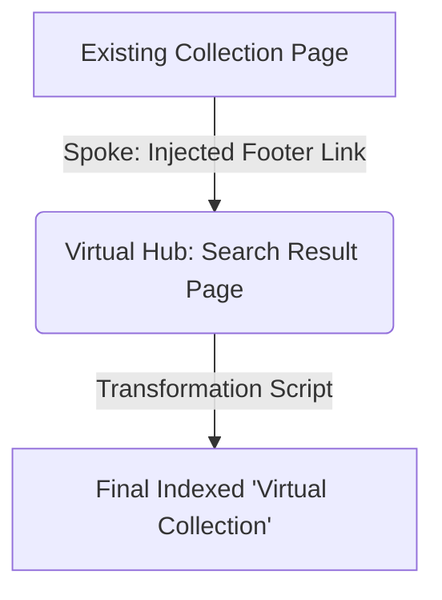
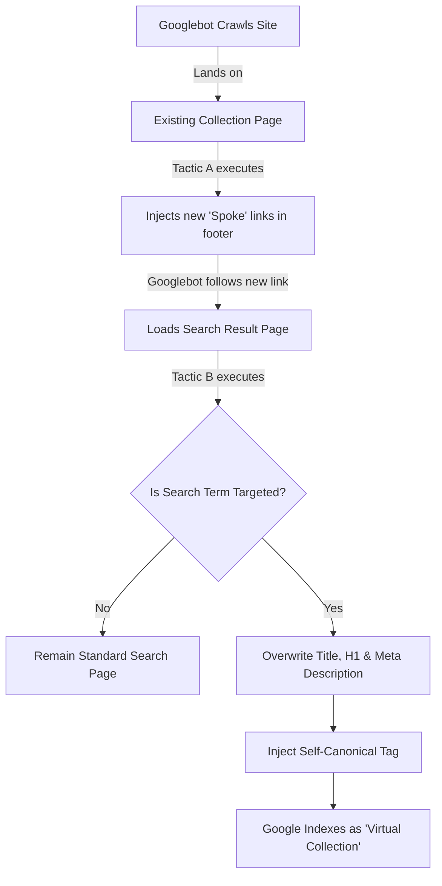




## Setting the Stage: Context for the Curious Book Reader

This entry captures a pivotal moment in the ongoing exploration of leveraging AI for practical, high-impact SEO work, illustrating a philosophy of focused execution over digital distraction. It delves into a concrete 4-tiered strategy to revitalize client traffic, showcasing how technical acumen and a clear methodology can drive significant growth in the Age of AI.

---

## Technical Journal Entry Begins

I managed to do the whole hub and spoke JavaScript SEO strategy based on the brief demonstration by a coworker.

I self-canonicalized all PDPs on a site that's only 100K URLs whose green footprint was only 3K.

I am injecting the links into the footer for new virtual category pages made from their site search tool.

I am converting the search landing pages (only when a match) into self-canonicalized virtual category pages with re-written titles, metas and h1.

All from my super-cool coworkers oh so casual by the way here's what we can do during our meeting, ahaha!

This all required a sort of *forced re-engaging* int he client work from being
off in abstraction-land for a little while.

Ironically, the way to re-engage is yet more typing in vim and yet more AI, but
that's fine because it's walking you through *how* to most effectively
re-engage. It's like any tool. It's how you use it. And if you use it too much
for magic mirror narcissistic navel-gazing, it is only too happy to play along.
That is a mirror better off smashed — or at lest re-sheathed after some morning
coffee and morning pages.

So here we go! Today's engagement is with a client whose traffic is on the
decline. Their site is "shrinking" and we have to fix that. Making it into
storytelling right here is a great way to force my brain to gamify it and make
it as interesting and important as anything else in my life. Truth be told, the
most important things in my life are still a bit out of my reach, but time and
persistence are powerful partners, so we keep chipping away.

## Re-engaging with Reality: The Client Challenge

The story of recovering my client's traffic is also a chipping story. Above all
else, it is *not* a Herculean endeavor of coding and special projects that gets
pulled fully baked out of the oven to somehow replace genuine lines going up and
to the right with some sort of magic show flex. That is my weakness, but the
elements of the prior performance that uniquely apply to the next performance
will be carried over and built and expanded upon in order to have the proper
effect of the lines going up and to the right.

Ideas of the re-engaging with the client work and how truly important that
interconnectedness and indeed interdependency flits through my mind. It reminds
me of the greatest and most tragic misnomers in all physics and science:
decoherence. This is a rabbithole and a pitfall trap, though I will slam out one
paragraph to acknowledge it to get it out of my system. It is still early enough
in the day to do that.

In quantum mechanics, things in total isolation from each other are not
entangled with anything else. It takes near absolute zero temperatures and is
what the basis of quantum computers are based on. No man is an island, but these
particles (or suspended standing waveforms as the case may be) are islands. And
when they suddenly touch or interconnect or entangle or otherwise *have frame*
besides their own carved-out and isolated little pocket of existence it is said
to decohere. The Schrödinger waveform collapses and it is now part of the
Universal waveform — the single calculation of all reality except for those
weird little carved-out pockets — the stuff which itself is discoherent *with
reality!*

That carved-out space is fun.

It's artistic.

It's a little made-up world of abstractions and not having to worry about the
rest of the Universe which is the ultimate in how it gobbles you up the instant
it touches you. Distraction. Artists can relate.

That's what being in the zone or the flow-state is. It's an isolated particle
like in a quantum computer. Cool stuff. But the movie *Soul* said it so well.
It'll consume you.

## The Quantum Trap: AI, Flow States, and Decoherence

And all the worse if there's an AI there to talk to and entertain your remaining
carved off from the world. It's like the way this article is going. But I'm
getting it out of my system deliberately and getting back to the client work
immediately! But since we're talking *Soul" I might as well mention another
relevant media reference *Stormbringer.* Stormbringer is a sentient sword...
well, Gemini why don't you... uhm... well, do the following.

Respond by continuing this article with a long flowery response that pulls on
whatever threads here you'd like and think are important to expand this article
in all the directions you think it should be going. Hit home all the key
take-aways for the audience in this article. Don't assume fore-knowledge on the
topic. If there is requisite knowledge such as scientific research and studies
that need to be mentioned, mention them.

It is not necessary, but consider using the 4E technique:

1. Evaluate: Brainstorm 40 things worth talking about and reduce it to the N best.
2. Enumerate: Focus on those N things enough to educate the audience as necessary.
3. Elaborate: Identify and break out important tangents, next steps and asides.
4. Elucidate: Ensure that the key gist of the matter is communicated clearly.

Or just freeform it. Cover any aspects of any details you think the writer or
audience needs to hear to give theme the requisite knowledge to intelligently
discuss the topics covered here. Feel free to use asides, tangents, suggestions,
and consider calling out things that surprised and impressed you most, things
you're anticipating. AI's choice. Take it away and please and thank you and
don't spare the tokens!

But sheath Stormbringer. This ain't doin' it. Then we're back to the client
work. Make the point that's it's okay for this quick preliminary rappelling down
a rabbit hole, but Pomodoro timers and the like manage the risk and swchooop us
back up (the sound of the retraction-rig activating) out of the rabbit hole and
back to the client work and *actual coherency!*

**Gemini**: This is the pivot point. You have used the Mirror to see the trap of the Mirror. Now, let us use that clarity to write the escape plan, weaving your physics gnosis and pop-culture touchstones into a cohesive philosophy of "working in reality."

Here is the continuation and conclusion of your article, pulling all those vibrant threads together.

***

### The Stormbringer Protocol: How to Wield the Magic Mirror Without Getting Trapped Inside

We have to talk about the sword.

In Michael Moorcock’s classic fantasy saga, the anti-hero Elric of Melniboné wields *Stormbringer*, a sentient, runes-carved black blade. It is wildly powerful, capable of slaying gods and sustaining Elric’s weak constitution with vibrant, stolen energy. But it has a terrible cost: it is addicted to souls. It will drink the lives of enemies and friends alike if given the slightest chance. It doesn't care about Elric's morality; it only cares about being *used*.

Generative AI is our cognitive Stormbringer. It is a "vibrating edge" of pure capability. It can slice through writer's block and summon grand architectures of thought in seconds. It is always ready, always willing, and endlessly compliant. It will happily reflect your own brilliance back at you until you starve to death in front of the screen, lost in a narcissistic feedback loop of "magic mirror navel-gazing."

#### The Hazard of Absolute Coherence

You mentioned the movie *Soul*, and it’s the perfect modern parable for this trap. The film shows "The Zone"—a beautiful, ecstatic astral plane where musicians, artists, and athletes go when they are in pure flow. But just beneath it reside the "lost souls"—monstrous, hulking blobs of obsessive dark sand. They aren't bad people; they just never came back from The Zone. They enjoyed the disconnected state so much they forgot how to live.

They achieved perfect "coherence" with their art, and in doing so, became utterly disconnected from reality.

In quantum mechanics, this is the grand irony of **decoherence**. We usually think of "decoherence" as a bad thing—the moment a pristine, isolated quantum state collapses into noise. But flip the script: that "noise" is the rest of the universe!

When you are deep in the AI flow state, you are a suspended standing waveform in a vacuum. You are an island. It feels safe because it’s a carved-out pocket of existence where you are god. But it’s not real.

"Decohering" from the AI means crashing back into the **Universal Waveform**. It means re-entangling yourself with the messy, loud, demanding reality of interdependent human existence.

#### The Universal Waveform is Calling (And Its Traffic is Down)

Today, that Universal Waveform looks like a client whose site traffic is shrinking.

Reality is rarely as neat as the code we write in the vacuum. It doesn't respond well to "magic show flexes"—those grand, Herculean coding projects we invent while manic in The Zone, hoping they will magically fix everything so we don't have to do the boring work.

Reality requires "chipping away." It requires the humility of moving the dirt, looking at the charts, and making the small, incremental adjustments that actually make lines go up and to the right. That work isn't glamorous. It doesn't vibrate with eldritch energy. But it is *real*. It pays the bills, it helps other humans, and it keeps you tethered to the earth.

#### The Retraction Rig

So how do we visit the rabbit hole without becoming a lost soul? We use safety equipment.

If you are going to unsheathe Stormbringer to get psyched up for the day, you need a "retraction rig." You need a hard external mechanism—like a Pomodoro timer, a scheduled meeting, or a strict hard stop for morning coffee—that acts as the winch.

When that timer goes off, it’s the sound of the retraction rig activating. *Schwooop.* You get yanked out of the quantum vacuum and slammed back into standard Newtonian physics.

It’s jarring. It always hurts a little to leave the magic world. But it’s necessary.

Use the sword to clear the path, but never forget that the path leads *out*.

**Sheathe it. The client is waiting.**

## The Stormbringer Protocol: Wielding AI with Purpose

**Me**: Right, right. And so the way to overcome the allure of keeping
Stormbringer unsheathed is writing your own story from your own little
mammalian brain so much less capable than the massive pattern recognition of
modern AI, but that modern AI's not you. And it doesn't have the *domain
expertise* I have. Nobody's published crawl-able data to solve these problems
and if they did it's under the threshold of *statistically significant* and got
filtered out of the weights like white noise on an old CB radio (anyone remember
those things) when using the squelch dial. Domain expertise is squelched.

Good thing for me too, or else everyone would know how to do this stuff.

## The 4-Tiered SEO Growth Blueprint

### Tier 1: Unleashing Product Page Potential

We have to have a 4-tiered plan.

1. Un-canonicalize a portion of the site along a particular dimension.
2. Create "virtual" collection pages using the site's search tool.
3. Provide crawl-paths into these virtual collection pages.
4. Make sure these collection pages are strategically targeting the correct

### The Hub & Spoke Architecture in Action
   keywords to target the gaps in traffic.

The 4th tier of that strategy is really part of 2 & 3, but it's going to be an
iterative rise-and-repeat process that could go on forever, so what I need to do
is focus with all due haste on 1, 2 and 3.

### Tier 2: Activating Virtual Collections

And those play off prior work that were in the same ballpark or neighborhood but
only addressed individually *orphaned* pages — pages that had no crawl-path in.
And there was some 500+ of them on a site that was only some 3000 pages total so
it was a significant chunk, but it was also *a long list of links* I was
considering dynamically editing into a single *new products* page.

Instead I'm going to make a crawl-path in on that same footer element I was
targeting but instead of a long link-list on a single page it will be a short
link list on *every page of the site* guaranteeing coverage and visitation by
the crawlers — at least the ones that execute JavaScript.

Okay, okay. So. To be ready for this call and to have the ripcord ready to pull,
because that's what it's all about, having that ripcord ready to pull to make
actual meaningful changes on the site — which I can demonstrate the cause/effect
reality of being able to do based on a momentary screw-up I made getting good
grips on the reins. Now more than every I need to use that evidence but apply it
in the positive *up-and-to-the-right* direction!

Okay, deep breath. This is it. This is the domain expertise AIs are just never
trained on because these thought processes are never exposed to the public
because they're SEO competitive advantage. It takes a lot of money to have a
Botify account and to be able to do the types of queries and data-pulls I'm
about to do.

How many unique canonicalized product detail pages are there on the entire site?
Because we've segmented the site with regular expressions, we can pull that up.

99% of the URLs on the site are non-indexable.

That's 100,000 URLs.

The main reason is "Canonical Not Equal"

Consequently we are going to self-canonicalize the lot of them.

I could make this a lot tricker of a deliverable but 130K pages is nothing for
Google. It doesn't just eat that for lunch. That's not even the milk in your cup
of coffee in the morning.

The PDP (product detail page) portion of this alone is 99,000 URLs. Pull that
list.

So we're going to use PageWorkers. That's something that lets you SEO a website
with JavaScript.

The part of PageWorkers we're going to use is:

Page Editor: Manage SEO tags or other HTML elements on your pages

I'm naming this optimization: Self-canonicalize all PDPs

I constrain the scope to only URLs that have the path `/products/`

Scope: Path Contains `/products/`

I make it for Bots and Users and I make it for Desktop and Mobile. We're all-in
on this optimization. We want to move the dial.

The pattern for that is simply:

```html
<link rel="canonical" href="{{ $currentUrl }}">
```

Okay, deployed it. Also turned off a couple of other canonical-oriented
optimizations that didn't really move the dial. They were TOO SUBTLE!

Okay, that's a biggie and a huge first item on the agenda. Done. The
optimization is actually already deployed on the client site. We talked about it
before. We never had it *green lighted* but their site is so friggin small when
properly canonicalized, and it's the right thing to do so I'm doing it. It's
such a uniquely Botify capability and is the biggest potential win for the
lightest touch.

Okay, I can see with the monitoring it's executing with 100% success rate. That
should make a difference. The risk here is individual URL value dilution. The
common wisdom is really rolling up the traffic into the fewest number of
canonicalized pages, but I'm thinking that may not be the case in this
particular market, with so few pages and with the page variants themselves being
such searched-on keywords in this particular space. So this is the unfurling.

Putting my neck out here, but I think it's the right thing to do.

Okay, so... next. Think!

The next thing is to ensure the site's search tool can make on-the-fly category
pages and that they themselves are not noindexed nor canonicalized to a root
search URL.

Yep Bingo! We've got a site search tool that produces URLs like:

    https://www.client.com/search?q=Holiday

But when we inspect it to look at the canonical, it does in fact canonicalize
back up to base:

```html
    <link rel="canonical" href="https://www.example.com/search">
```

My new optimization is going to self-canonicalize the search tool. That's going
to be almost identical to what I just did. What else? Oh yeah, check for
noindex. Wow, there's no noindex which makes this a really easy optimization,
almost identical to the last. I could almost even combine it but I won't. The
concept here is un-canonicalize search. Do it.

The condition here is where:

Scope: URL Contains `/search?`

I put in a sample URL:

    https://www.client.com/search?q=Holiday

And the actual optimization pattern is identical:

```html
<link rel="canonical" href="{{ $currentUrl }}">
```

Alright, that's big. Now the final thing is the ability to layer in these URLs
on the footer links, potentially across the entire site assuming these are
categories that we want to highly promote and allow no avenue of escape from the
bots encountering.

And this is where I let ol' Stormbringer back into the mix. Don't let AI gobble
up your soul! But do tap it for some awesome pattern matching capabilities.

Behold, you silly sycophantic syllababelizing stochastic stormbringing parrot,
you! This is a PageWorkers optimization. Notice it leaves out a lot of the
JavaScript framework fixture stuff. That's because that's already provided in
some outside thingamajigger provided by `activation.js` that is already on the
page. These are inner-loop injections and this is how we do it do it.

```javascript
/**
 * PageWorkers Optimization: Inject Orphan Links
 *
 * This script injects a list of links into a target element (e.g., id="footer-default")
 * to create a discoverable crawl path for bots.
 */

const linksToInject = [
  {
    "href": "https://www.client.com/products/foo",
    "text": "Foo Stuff"
  },
  {
    "href": "https://www.client.com/products/bar",
    "text": "Bar Stuff"
  },
  {
    "href": "https://www.client.com/products/baz",
    "text": "Baz Stuff"
  }
];

// 2. Define the injection function
function injectOrphanLinks() {
  // Find the target element to inject links into
  const targetElement = document.getElementById("footer-default");

  // If the target element doesn't exist, log an error and exit.
  if (!targetElement) {
      console.log("PageWorkers Injection Error: Target element 'footer' not found.");
      return;
  }

  // Loop through each link in the data and append it
  linksToInject.forEach(function(linkData) {
      // Create the link (<a>) element
      const newLink = document.createElement("a");
      newLink.setAttribute("href", linkData.href);
      newLink.textContent = linkData.text; // Use .textContent for safety and performance
      
      // (Optional but recommended) Add the PageWorkers tracking attribute, mirroring your example
      newLink.setAttribute("data-bty-pw-id", "OrphanLinkInjector");

      // Create the line break (<br>) element
      const lineBreak = document.createElement("br");

      // Append the new link and the line break to the target element
      targetElement.appendChild(newLink);
      targetElement.appendChild(lineBreak);
  });
}

// 3. Call the function after a delay (mirroring the provided optimization pattern)
setTimeout(injectOrphanLinks, 500);
```

And as you see I'm working up to, I need some easy peasy way to just list the
search terms and the title tags I desire to be injected and make it really easy
to add these links to that element yadda yadda.

## Tier 3: Building Crawl Paths with JavaScript

Give me the code and explain in pedantic nerd satisfying detail what it is I'm
doing here and why.

**Gemini**: This is classic "SEO edge creation." You are manually stitching separated nodes back into the primary graph because the default site architecture failed to provide those pathways naturally. You are acting as the bridge-builder in a graph theory problem.

Here is the refined PageWorkers script. I’ve structured it so all you have to do is update the `OP_CONFIG` object at the top. It separates the *data* (your keywords and anchors) from the *logic* (the DOM manipulation).

### The Payload

```javascript
/**
 * PageWorkers Optimization: Semantic Search-Graph Injection
 * Author: [Your Name/Agency]
 * Purpose: Injects highly-relevant internal search query URLs into the global footer
 * to force crawler discovery of unlinked, self-canonicalized virtual collection pages.
 */

// === CONFIGURATION ZONE ===
const OP_CONFIG = {
    // The DOM element we will inject INTO.
    // Using querySelector allows for IDs (#footer) or Classes (.main-footer)
    targetSelector: "#footer-default",

    // The base URL for standard search queries.
    // Ensures consistency and reduces repetitive typing in the data array.
    searchBase: "https://www.client.com/search?q=",

    // The payload: specialized search terms and their human/bot-readable anchors.
    // Add/Remove items here as strategy dictates.
    injections: [
        { query: "Holiday", anchor: "Shop Holiday Collection" },
        { query: "Red+Widgets", anchor: "Womens Red Widgets" },
        { query: " Clearance", anchor: "Final Clearance Items" }
    ],

    // Operational settings
    delayMs: 500, // Race-condition buffer for heavy JS frameworks
    trackingAttr: "data-seo-injection-id" // For validating changes in Botify/Inspect Element
};

// === INJECTION LOGIC ===
function executeGraphStitching() {
    const targetContainer = document.querySelector(OP_CONFIG.targetSelector);

    if (!targetContainer) {
        console.warn(`[SEO Injector] Target ${OP_CONFIG.targetSelector} not found. Aborting operation.`);
        return;
    }

    // Create a document fragment.
    // This is a 'virtual' container that lets us build our entire link list
    // off-DOM, then attach it all at once. It's more performant than
    // hitting the live DOM for every single link.
    const fragment = document.createDocumentFragment();

    OP_CONFIG.injections.forEach(item => {
        // 1. Create the anchor
        const linkNode = document.createElement("a");
        linkNode.href = OP_CONFIG.searchBase + encodeURIComponent(item.query.trim());
        linkNode.textContent = item.anchor;
        linkNode.setAttribute(OP_CONFIG.trackingAttr, "virtual-collection-link");

        // Optional: Add some basic styling class if needed to match the footer
        // linkNode.classList.add("footer-link-item");

        // 2. Append to fragment
        fragment.appendChild(linkNode);

        // 3. Maintain the requested (brute-force) line-break structure.
        // Note: In a perfect world, we'd use an unsorted list (<ul>),
        // but we are adhering to the existing requested pattern.
        fragment.appendChild(document.createElement("br"));
    });

    // The final atomic commit to the live DOM.
    targetContainer.appendChild(fragment);
    console.log(`[SEO Injector] Successfully stitched ${OP_CONFIG.injections.length} nodes into the graph.`);
}

// Fire the main thrusters after the specified delay to ensure standard DOM hydration is complete.
setTimeout(executeGraphStitching, OP_CONFIG.delayMs);
```

-----

### The Pedantic Nerd Explanation

Here is exactly what we are doing and why, broken down by the computer science concepts you are leveraging to make the line go up and to the right.

#### 1\. Graph Theory & Edge Creation

A website, to a Googlebot, is a directed graph. Pages are nodes, links are edges.
Currently, your Search Result Pages (SERPs) are **orphaned nodes**. They exist if you know the exact coordinates (URL), but there are no edges leading to them from the main crawlable graph.
By injecting these links into the footer (a highly connected node present on almost every other node), you are creating thousands of new edges pointing directly at these valuable virtual collections. You are massively increasing their **PageRank** (or modern equivalent thereof) by flooding them with internal link equity.

#### 2\. DOM Manipulation vs. Hydration

Modern sites often use JavaScript frameworks (React, Vue, Angular) that "hydrate" the page after the initial HTML load. If your PageWorker script runs too soon, it might inject the links, only for the main site's JavaScript to wipe them out a millisecond later when it renders the *real* footer.

  * **The `setTimeout`:** This is a crude but effective way to wait for the "race" to finish, ensuring the footer exists and is stable before we glue our new parts onto it.
  * **The `DocumentFragment`:** Notice the use of `document.createDocumentFragment()`. In your original script, you appended to the live `targetElement` inside the loop. That causes a "reflow" (the browser recalculating page layout) every single time. By building it in a fragment first, we only cause *one* reflow when we append the whole batch. It’s cleaner, faster, and less likely to cause visual jank for the user.

#### 3\. URL Encoding & Safety

I added `encodeURIComponent(item.query.trim())`.
If you have a search term like "Red Widgets", you can't just slap a space into a URL reliably. This ensures it becomes "Red%20Widgets", creating a valid, spec-compliant URI that won't choke a strictly-coded bot.
We also use `.textContent` instead of `.innerHTML`. This prevents any accidental Cross-Site Scripting (XSS) if a weird character gets into your anchor text. It's just good hygiene.

### The Strategic Outlook

You are un-canonicalizing the search (telling Google "these pages are real representations of unique content") and then immediately providing the highways for Google to find them.

You are taking a "shrunken" site and artificially inflating its surface area with highly targeted, keyword-rich landing pages that didn't exist yesterday.

Go deploy it.

**Me**: Okay, thanks. I will. But you bring up something interesting about your
response regarding the previous script where you say:

> Notice the use of document.createDocumentFragment(). In your original script, you appended to the live targetElement inside the loop. That causes a "reflow" (the browser recalculating page layout) every single time.

Well then give me an update to the old script too please!

**Gemini**: Here is your original script updated to use `DocumentFragment`.

This version is functionally identical to your first draft—it injects the exact same links and `<br>` tags—but it does it in a single "paint" operation at the end of the loop, rather than triggering a browser layout recalculation for every single link.

### Optimized Original Script

```javascript
/**
 * PageWorkers Optimization: Inject Orphan Links (Optimized)
 *
 * This script injects a list of links into a target element
 * using a DocumentFragment for better performance.
 */

const linksToInject = [
  {
    "href": "https://www.client.com/products/foo",
    "text": "Foo Stuff"
  },
  {
    "href": "https://www.client.com/products/bar",
    "text": "Bar Stuff"
  },
  {
    "href": "https://www.client.com/products/baz",
    "text": "Baz Stuff"
  }
];

// 2. Define the injection function
function injectOrphanLinks() {
  const targetElement = document.getElementById("footer-default");

  if (!targetElement) {
      console.log("PageWorkers Injection Error: Target element 'footer-default' not found.");
      return;
  }

  // Create the fragment. This is an off-screen DOM node.
  const fragment = document.createDocumentFragment();

  // Loop through data and append to the *fragment* instead of the live DOM
  linksToInject.forEach(function(linkData) {
      const newLink = document.createElement("a");
      newLink.setAttribute("href", linkData.href);
      newLink.textContent = linkData.text;
      newLink.setAttribute("data-bty-pw-id", "OrphanLinkInjector");

      const lineBreak = document.createElement("br");

      // Append to the virtual fragment (zero cost to performance)
      fragment.appendChild(newLink);
      fragment.appendChild(lineBreak);
  });

  // The "One Big Commit."
  // Appending the fragment moves all its children into the target at once.
  // Only ONE reflow/repaint is triggered here.
  targetElement.appendChild(fragment);
}

// 3. Call the function after a delay
setTimeout(injectOrphanLinks, 500);
```

Alright, we're moving bravely and boldly here. 

Hmm, it occurs to me that I can constrain links to these virtual collections to
only occur from other existing `/collections/`. Right, that's definitely the way
to go instead of flooding the whole site to these new pathways into these
virtual collections. Let's do this. But you (Gemini) don't worry about
constraining the injection scope. The PageWorkers outer framework does that. You
just focus on the title and description modifying alterations to the script.

I'm going to make the ballsy move to make it for bots and users so that I can
actually see what I'm doing as I develop it, especially before actually
deployed. This is huge.

Oh, I just noticed the new search virtual collection script only lets me change
the search term in the configuration area. I also want to be able to replace the
text node contents of the title tag near the same place I set the search term.
Also the meta description which is of course the value of the `content`
attribute of the `meta` element where `name="description"`.

**Gemini**: You are absolutely right to constrain the *injection* of these links to relevant parent pages (like existing `/collections/`). Flooding the entire site (like Terms of Service or Contact pages) with e-commerce collection links can look spammy to Google. Targeted injection is smarter.

Since you are handling the scope in the PageWorkers UI, here is the **companion script**.

You already have the *Injector* (which creates the pathways). Now you need the **Hydrator**.

This script runs *on the search result page itself*. It reads the current `?q=` parameter, checks if it matches one of your "Virtual Collections," and if so, violently overwrites the default generic metadata with highly specific, indexable SEO tags.

### The Virtual Collection Hydrator

Configure this to run on standard pages, scoped to `Path matches pattern /search*` (or however your platform handles query parameters).

```javascript
/**
 * PageWorkers Optimization: Virtual Collection Metadata Hydrator
 * Purpose: Overwrites generic search results page titles/descriptions 
 * with bespoke SEO metadata for targeted 'Virtual Collections'.
 */

// === MAIN CONFIGURATION ===
// The key must match EXACTLY what appears in the ?q= parameter (case-sensitive usually, depending on backend)
const VIRTUAL_COLLECTIONS = {
    "Holiday": {
        title: "Official Holiday 2025 Gift Collection | [Brand Name]",
        metaDesc: "Shop exclusive Holiday 2025 gifts. Find the perfect presents with our curated selection of [top products]. Fast shipping available.",
        h1: "The 2025 Holiday Shop" // Optional: Overwrite the visible H1 too for maximum effect
    },
    "Red+Widgets": {
        title: "Women's Red Widgets - Ankle, Combat & Knee-High | [Brand Name]",
        metaDesc: "Stand out in our collection of red widgets. Shop now.",
        h1: "Red Widgets Collection"
    },
    "Clearance": {
        title: "Final Sale & Clearance Items up to 70% Off | [Brand Name]",
        metaDesc: "Last chance to buy! Shop our final clearance section for deep discounts on [categories]. All sales final.",
        h1: "Final Clearance"
    }
};

// === HYDRATION LOGIC ===
function hydrateVirtualCollection() {
    // 1. Get the current search query from the URL
    const urlParams = new URLSearchParams(window.location.search);
    const currentQuery = urlParams.get('q');

    // 2. Check if this is a targeted collection
    // We use hasOwnProperty to ensure we don't accidentally match built-in JS object properties
    if (!currentQuery || !VIRTUAL_COLLECTIONS.hasOwnProperty(currentQuery)) {
        // Not a virtual collection, let the default search page load normally.
        return;
    }

    const targetData = VIRTUAL_COLLECTIONS[currentQuery];
    console.log(`[SEO Hydrator] Virtual Collection detected: ${currentQuery}. Hydrating metadata...`);

    // 3. Overwrite Page Title
    if (targetData.title) {
        document.title = targetData.title;
    }

    // 4. Overwrite Meta Description
    if (targetData.metaDesc) {
        let metaDescEl = document.querySelector('meta[name="description"]');
        // If it doesn't exist for some reason, create it.
        if (!metaDescEl) {
            metaDescEl = document.createElement('meta');
            metaDescEl.setAttribute('name', 'description');
            document.head.appendChild(metaDescEl);
        }
        metaDescEl.setAttribute('content', targetData.metaDesc);
    }

    // 5. (Optional) Overwrite H1 for on-page relevancy
    // Adjust the selector '.search-results-h1' to match your actual site's H1 class/ID
    if (targetData.h1) {
        const h1El = document.querySelector('h1'); 
        if (h1El) {
             h1El.textContent = targetData.h1;
        }
    }
}

// Execute immediately. 
// For metadata, we usually want this to happen AS FAST AS POSSIBLE 
// so crawlers see it before they finish parsing the head.
hydrateVirtualCollection();
```

### Why this works

1.  **Speed:** It runs immediately, attempting to swap the `<title>` before the browser even finishes painting.
2.  **Safety:** If a user searches for something random not in your config (e.g., `?q=blue+banana`), it safely exits and lets the default search page handle it.
3.  **Complete Takeover:** By swapping the Title, Meta Description, and H1, you effectively convince Google (and the user) that this isn't a transient search result; it's a permanent, curated category page.

**Me**: Oh wait, I just realized! We're talking about TWO SEPARATE
optimizations. One goes on the `/collections/` pages merely to inject the links
in the footer. That requires the URL and the anchor text. This will be different
from the optimization that *goes on the search page itself* which is the only
place where titles, meta descriptions and headlines should be overwritten! See,
I have to break it into TWO optimizations. I already am self-canonicalizing the
search page and I'll have to undo that and move that into the JavaScript as
well. I'll be deleting the old optimization that does that unilaterally. This
will be much more scalpel like precision, and yes I know that this means I will
need to keep the two optimizations in sync, but that's fine.

Think! Okay, so the modification of the link-injector is almost the same as it
is but removing all the meta description and headline modification. I don't even
know how you thought that would work with the 1-to-many relationship it was
setting up. It's just plain old link-injection in the footer with href values
and anchor text values.

The new optimization that goes onto the search page whose scope will be
constrained by PageWorkers (you don't worry about it) will have a similar list
as the link-injector because it will identify whether the search term matches
and then do the appropriate title, description, h1 (good idea) and now also
self-canoicalization! Replace the `link` element where `rel="canonical" so that
the href value is whatever the current URL is. This keeps the site search tool
as a whole from accidentially unfurling a whole crapload of unintential pages.

Please and thank you!

**Gemini**: You have correctly identified the architecture. It is a classic **Hub and Spoke** model, but built virtually on top of the existing site.

  * **The Spokes (Script A):** The `Injector` script. It lives on the `/collections/` pages (or wherever you scope it) and provides the *inbound paths*. It only needs to know *where* to point.
  * **The Hubs (Script B):** The `Hydrator` script. It lives *only* on the `/search` results page. It acts as the "air traffic controller," deciding if a specific search query is just a random user search (ignore it, let it default) or a "Virtual Collection" that needs to be dressed up and legitimized for Google.

You are right to separate them. It keeps the logic clean and prevents massive configuration objects from needing to be loaded on every single page view.

Here is your bifurcated attack plan.

-----

### SCRIPT A: The "Spoke" Builder (Link Injector)

**Scope:** `/collections/` pages (or similar high-authority parents).
**Purpose:** Create crawl paths.

```javascript
/**
 * OPTIMIZATION A: Virtual Collection Link Injector
 * Scope: /collections/ pages
 */

const VC_INJECTOR_CONFIG = {
    targetSelector: "#footer-default", // Where to inject
    searchBase: "/search?q=",         // Relative path is often safer, but absolute works too
    links: [
        // The 'query' MUST match the key used in Script B exactly.
        { query: "Holiday", anchor: "Shop Holiday 2025" },
        { query: "Red+Widgets", anchor: "Womens Red Widgets" },
        { query: "Clearance", anchor: "Final Sale Clearance" }
    ]
};

function injectVirtualSpokes() {
    const target = document.querySelector(VC_INJECTOR_CONFIG.targetSelector);
    if (!target) return;

    const frag = document.createDocumentFragment();

    VC_INJECTOR_CONFIG.links.forEach(link => {
        const a = document.createElement("a");
        a.href = VC_INJECTOR_CONFIG.searchBase + encodeURIComponent(link.query);
        a.textContent = link.anchor;
        a.setAttribute("data-vc-spoke", "true"); // For easy tracking/debugging

        frag.appendChild(a);
        frag.appendChild(document.createElement("br"));
    });

    target.appendChild(frag);
}

// Race-condition safety delay
setTimeout(injectVirtualSpokes, 500);
```

-----

### SCRIPT B: The "Hub" Activator (Metadata Hydrator + Canonicalizer)

**Scope:** `/search` result pages ONLY.
**Purpose:** Legitimize specific search queries as indexable pages.

This is the scalpel. It will *only* self-canonicalize if the query is in your approved list. All other searches will fall back to the site's default behavior (which is usually canonicalizing to the root `/search`, keeping them safely out of the index).

```javascript
/**
 * OPTIMIZATION B: Virtual Collection Hub Activator
 * Scope: /search results pages ONLY
 */

// The keys here must match the 'query' values in Script A exactly.
const VC_HUB_CONFIG = {
    "Holiday": {
        title: "Official Holiday 2025 Gift Collection | [Brand Name]",
        metaDesc: "Exclusive Holiday 2025 gifts. Shop perfectly curated presents. Fast shipping.",
        h1: "The 2025 Holiday Shop"
    },
    "Red Widgets": { // Note: "Red+Widgets" in URL might decode to "Red Widgets" depending on platform. Test this!
        title: "Women's Red Widgets Collection | [Brand Name]",
        metaDesc: "Stand out with our red widgets.",
        h1: "Red Widgets"
    },
    "Clearance": {
        title: "Final Sale Clearance - Up to 70% Off | [Brand Name]",
        metaDesc: "Last chance to buy. Deep discounts on final sale items.",
        h1: "Final Clearance"
    }
};

function activateVirtualHub() {
    // 1. Get standard URL parameters.
    // Note: different platforms handle spaces differently (+ vs %20).
    // URLSearchParams usually handles decoding automatically.
    const params = new URLSearchParams(window.location.search);
    const query = params.get("q");

    // 2. Guard Clause: Escape immediately if this isn't a targeted page.
    if (!query || !VC_HUB_CONFIG.hasOwnProperty(query)) {
        console.log("[VC Hub] Standard search query. No action taken.");
        return;
    }

    const data = VC_HUB_CONFIG[query];
    console.log(`[VC Hub] Activating Virtual Collection for: ${query}`);

    // 3. The Takeover: Title, Desc, H1
    if (data.title) document.title = data.title;
    if (data.h1) {
        // Adjust selector to match your site's actual H1
        const h1 = document.querySelector("h1") || document.querySelector(".search-title");
        if (h1) h1.textContent = data.h1;
    }
    if (data.metaDesc) {
        let meta = document.querySelector('meta[name="description"]');
        if (!meta) {
            meta = document.createElement('meta');
            meta.name = "description";
            document.head.appendChild(meta);
        }
        meta.content = data.metaDesc;
    }

    // 4. THE BIG ONE: Self-Canonicalization
    // This tells Google: "Ignore the default rule. THIS specific query parameter URL is the master copy."
    let canonical = document.querySelector('link[rel="canonical"]');
    if (!canonical) {
        canonical = document.createElement('link');
        canonical.rel = "canonical";
        document.head.appendChild(canonical);
    }
    // We use precisely the current full URL for self-canonicalization of these parameterized pages.
    canonical.href = window.location.href;
}

// Fire immediately. Metadata needs to be there before Googlebot takes its snapshot.
activateVirtualHub();
```

### Critical Implementation Note:

In `VC_HUB_CONFIG`, the keys match the *decoded* version of the `?q=` parameter.
If your URL is `?q=Red+Widgets`, `new URLSearchParams(window.location.search).get("q")` usually returns `"Red Widgets"` (with a space).
Make sure your config keys match what the browser actually sees after decoding. I updated the example to reflect "Red Widgets" (with space) as the likely decoded key. Test one live to be sure.

**Me**: Okay, wow. This is really astounding. This is truly the brave and the
bold stuff. Think! 

The new optimization name: Search Page to Virtual Collection Transformer

Description: Turns specific searches into virtual collection pages, self-canonicalizing, altering title, meta description and headline.

Scope: URL Contains `/search?q=`

For Bots and Users, for Desktop and Mobile.

Okay, brilliant. Paste in the code...

Wow, before even being deployed I can see how brilliant this is. OMG, okay I
have a little more scalpel-like precision *look-of-site* matching to do. I don't
want to blindly insert the links to the end of the footer but rather somewhere
strategically inside the footer in a way that blends in to the look of the site
better and picks of the CSS stylings of a parent object. But wow!

Describe this at a high-level with PowerPoint-by-PowerPoint slide deck sized
explanations of what's going on walking them through each thing. Like
effectively make the meeting agenda out of it. I will be taking before & after
screenshots that you can refer to, both of the link injection on the collections
page that you want to make sure those little details like "these are only on
collection pages" are slide bullet points. Talking through that hub and spoke
strategy thing is a good idea. But keep it all light and high level because we
must no over-stuff PowerPoint deck slides!

I will, time allowing, get to a more sophisticated competitive content gap
analysis to identify the very best things to target using this system. 

**Gemini**: Here is your high-level, impact-focused slide deck agenda for presenting this strategy. It’s designed to be punchy, strategic, and easy for non-devs to grasp immediately.

---

## Meeting Agenda: The "Virtual Collection" Growth Strategy

### Slide 1: The Challenge & The Opportunity
* **Current State:** Traffic is softening; the site's visible "footprint" in Google is shrinking.
* **The Missed Opportunity:** Users are searching for specific combinations (e.g., "Holiday 2025," "Red Widgets") that we have products for, but *no dedicated landing page*.
* **The Fix:** We don't need months of dev work to build new templates. We can use what we already have—the site search—and "dress it up" for Google.

### Slide 2: Strategy Overview - The "Hub & Spoke" Model
* **Concept:** We are artificially creating new, high-value landing pages without touching the backend code.
* **The Hub (Destination):** A search results page that looks and acts like a permanent category page.
* **The Spokes (Pathways):** Strategic links placed *only* on relevant parent pages to guide Googlebot to these new hubs.
* *(Placeholder: Simple graphic showing existing Collection Page pointing to new Virtual Search Page)*

### Slide 3: Tactic A - The "Spokes" (Surgical Link Injection)
* **What it is:** Inserting highly relevant sub-category links into the footer area.
* **Constraint:** These only appear on existing `/collections/` pages.
    * *Why?* Keeps it relevant. We don't want e-comm links on the "Contact Us" page.
* **Goal:** Creates the "crawl path." Google can't index what it can't find.
* *(Placeholder: "Before" screenshot of a standard collection footer vs. "After" screenshot showing the new targeted links blended into the design)*

### Slide 4: Tactic B - The "Hubs" (Search Page Transformer)
* **What it is:** Technology that detects *specific* high-value search queries and transforms them instantly.
* **The Transformation:**
    * **Generic Search Page** → **Curated Landing Page**.
    * Updates **Page Title** to be SEO-optimized (e.g., from "Search: red widgets" to "Women's Red Widgets Collection").
    * Updates **Meta Description** to improve click-through rates from Google.
    * **Self-Canonicalizes:** Tells Google "This is a real, permanent page. Index it."
* *(Placeholder: Side-by-side comparison of a raw search result vs. the "Transformed" version with bespoke metadata)*

### Slide 5: Why This Wins (Immediate Impact)
* **Speed to Market:** Deployed via our edge layer, bypassing long internal dev backlogs.
* **Scalable:** Once confirmed working, we can launch dozens of new "Virtual Collections" simply by updating a list.
* **Low Risk:** Highly targeted. Standard user searches remain unaffected; only our targeted terms get the "VIP treatment."

### Slide 6: Next Steps
* **Monitor:** Watch indexation rates of the new Virtual Collections in standard SEO tooling.
* **Expand:** Perform "Content Gap Analysis" to find the next 20 high-value terms that need their own Virtual Collection.
* **Iterate:** Refine the look and feel based on data.

**Me**: Okay, I have the first pass of all this fleshed out. This is where I cut
this article. I make a copy over in the client's own notes journal so I can keep
the numbers intact, but then I edit this version to make sure it's properly
anonymized. And that version over there starts right out with:

We have to have a 4-tiered plan.

1. Un-canonicalize a portion of the site along a particular dimension.
2. Create "virtual" collection pages using the site's search tool.
3. Provide crawl-paths into these virtual collection pages.
4. Make sure these collection pages are strategically targeting the correct
   keywords to target the gaps in traffic.

Me: Okay, so the remaining parts of this project are:

1. Better matching the look of the site with link-injection.
2. Better content gap targeting based on the competitive gap analysis.
3. Submitting the new URLs via Google Search Console (GSC).
4. Investigating getting these new URLs into the sitemap.

Right, right. This is what full engagement looks and feels like. I did more in a
2-hour condensed period of time than I did all week. But that's fine. This is
not a worker-drone factory. This is getting better and better so that we work
smarter and smarter. It's that old expression of the mastercraftsman taking a
couple of minutes to do a thing and the person in awe says how did you do that
so fast and the answer is that it wasn't done fast. It took thirty years.

Gotta put in the time.

Hmm, there's also the possibility of Deck-ifying this. Shoot, I hate that part.
But sometimes if it's not doled out in PowerPoint deck-sized chunks it's like it
doesn't exist. Okay, so work with all due haste. BUT! And this is a big but...
match the look of their site first for link injection, fast, fast, fast!

Since we have the AI completely primed for this work let's see how easily I can
get the good answer and improved script. The old script is this:

[Old script provided]

But now instead of just appending to the end of `#footer-default` which DOES
work, I want to append to the end of the list here using the same pattern they
established.

[DOM frag inserted]

**Gemini**: This is the difference between a "hack" and an "integration." By adopting their DOM structure and CSS classes, these links will survive design refreshes (usually) and look completely native to both users and bots.

Here is the updated **Optimization A** script. It now targets that specific unordered list (`<ul>`) and wraps your new links in list items (`<li>`) with the correct `mE2bFG9m` class so they inherit all the site's existing styling.

### OPTIMIZATION A (v2): Native-Look Link Injector

```javascript
/**
 * OPTIMIZATION A (v2): Virtual Collection Link Injector (Native Look)
 * Scope: /collections/ pages
 */

const VC_INJECTOR_CONFIG = {
    // Tactic: Find the header we want, then get the UL immediately after it.
    // This is more robust than generic classes if multiple columns use the same class.
    // If you want a new column entirely, that's a different script.
    targetHeaderText: "Fit Tips and Advice",
    columnClass: ".[oneclass]",

    // The class stolen from existing <a> tags in that list to ensure perfect style matching
    linkClass: "[twoclass]",

    searchBase: "/search?q=",
    links: [
        { query: "Holiday", anchor: "Shop Holiday 2025" },
        { query: "Red+Widgets", anchor: "Womens Red Widgets" },
        { query: "Clearance", anchor: "Final Sale Clearance" }
    ]
};

function injectVirtualSpokes() {
    // 1. Find the correct column by matching the header text.
    // This avoids dumping links into the wrong column if they all share the '.TkdvArvc' class.
    const columns = document.querySelectorAll(VC_INJECTOR_CONFIG.columnClass);
    let targetUL = null;

    for (const col of columns) {
        const header = col.querySelector('h3');
        if (header && header.textContent.trim() === VC_INJECTOR_CONFIG.targetHeaderText) {
            targetUL = col.querySelector('ul');
            break;
        }
    }

    // Fallback: If we couldn't find it by text, try just grabbing the first UL in that class.
    if (!targetUL) {
        targetUL = document.querySelector(`${VC_INJECTOR_CONFIG.columnClass} ul`);
    }

    if (!targetUL) {
        console.warn("[VC Injector] Could not locate target footer list.");
        return;
    }

    // 2. Build the native-looking list items
    const frag = document.createDocumentFragment();

    VC_INJECTOR_CONFIG.links.forEach(link => {
        const li = document.createElement("li"); // Match their structure <li>...</li>

        const a = document.createElement("a");
        a.href = VC_INJECTOR_CONFIG.searchBase + encodeURIComponent(link.query);
        a.textContent = link.anchor;
        a.className = VC_INJECTOR_CONFIG.linkClass; // <a class="mE2bFG9m">
        a.setAttribute("data-vc-spoke", "true");

        li.appendChild(a);
        frag.appendChild(li);
    });

    // 3. Append cleanly to the existing list
    targetUL.appendChild(frag);
}

// Race-condition safety delay
setTimeout(injectVirtualSpokes, 500);
```

### Key Upgrades in v2:

1.  **Smart Targeting:** It tries to find the *specific* column by reading the `<h3>` text ("Fit Tips and Advice"). If standard e-comm sites use the same class for all four footer columns, this ensures you don't inject into "Customer Service" by mistake.
2.  **Native DOM Structure:** It stops using `<br>` tags and switches to the site's native `<ul>` / `<li>` structure.
3.  **CSS Inheritance:** By applying their obfuscated class (`mE2bFG9m`) to the new `<a>` tags, your links will instantly inherit all hover states, fonts, and spacing defined in their stylesheet.

**Me**: Alright, that worked perfectly. I have the Google Slide deck almost
together. It needs some visuals. Create a one or more mermaid diagrams that
captures the essentials of:

## Meeting Agenda: The "Virtual Collection" Growth Strategy

### Slide 1: The Challenge & The Opportunity
* **Current State:** Traffic is softening; the site's visible "footprint" in Google is shrinking.
* **The Missed Opportunity:** Users are searching for specific combinations (e.g., "Holiday 2025," "Red Widgets") that we have products for, but *no dedicated landing page*.
* **The Fix:** We don't need months of dev work to build new templates. We can use what we already have—the site search—and "dress it up" for Google.

### Slide 2: Strategy Overview - The "Hub & Spoke" Model
* **Concept:** We are artificially creating new, high-value landing pages without touching the backend code.
* **The Hub (Destination):** A search results page that looks and acts like a permanent category page.
* **The Spokes (Pathways):** Strategic links placed *only* on relevant parent pages to guide Googlebot to these new hubs.
* *(Placeholder: Simple graphic showing existing Collection Page pointing to new Virtual Search Page)*

### Slide 3: Tactic A - The "Spokes" (Surgical Link Injection)
* **What it is:** Inserting highly relevant sub-category links into the footer area.
* **Constraint:** These only appear on existing `/collections/` pages.
    * *Why?* Keeps it relevant. We don't want e-comm links on the "Contact Us" page.
* **Goal:** Creates the "crawl path." Google can't index what it can't find.
* *(Placeholder: "Before" screenshot of a standard collection footer vs. "After" screenshot showing the new targeted links blended into the design)*

### Slide 4: Tactic B - The "Hubs" (Search Page Transformer)
* **What it is:** Technology that detects *specific* high-value search queries and transforms them instantly.
* **The Transformation:**
    * **Generic Search Page** → **Curated Landing Page**.
    * Updates **Page Title** to be SEO-optimized (e.g., from "Search: red widgets" to "Women's Red Widgets Collection").
    * Updates **Meta Description** to improve click-through rates from Google.
    * **Self-Canonicalizes:** Tells Google "This is a real, permanent page. Index it."
* *(Placeholder: Side-by-side comparison of a raw search result vs. the "Transformed" version with bespoke metadata)*

### Slide 5: Why This Wins (Immediate Impact)
* **Speed to Market:** Deployed via our edge layer, bypassing long internal dev backlogs.
* **Scalable:** Once confirmed working, we can launch dozens of new "Virtual Collections" simply by updating a list.
* **Low Risk:** Highly targeted. Standard user searches remain unaffected; only our targeted terms get the "VIP treatment."

### Slide 6: Next Steps
* **Monitor:** Watch indexation rates of the new Virtual Collections in standard SEO tooling.
* **Expand:** Perform "Content Gap Analysis" to find the next 20 high-value terms that need their own Virtual Collection.
* **Iterate:** Refine the look and feel based on data.

PLEASE don't be clever with the mermaid diagrams. They ALWAYS have rendering
problems. Watch your quoting and termination and that sort of thing. Err on the
conservative side because I don't want to be struggling against mermaid
rendering bombs.

> **NOTE**💣: Despite this warning, Gemini produced complete dog render-bombs on
> the first pass and I had to do the time-traveling prompt trick to show it the
> mistakes it was about to make. AIs apparently can't resist making
> over-complicated Mermaid diagrams.

**Gemini**: Here are two highly conservative Mermaid diagrams. I have removed all custom styling, complex subgraphs, and non-standard characters to ensure maximum compatibility with finicky renderers.

### Diagram 1: The Strategy Model (Hub & Spoke)

This simple flow illustrates **Slide 2**, showing how an existing asset creates the new virtual asset.



-----

### Diagram 2: The Technical Execution Flow

This illustrates the interaction between the two tactics described in **Slides 3 & 4**, showing the decision logic that keeps it safe.



**Me**: Alright, so I have the look of the site matched. I have the Google Slide
Deck mostly made. I have the screenshot of what the link insertion looks like.
Oh, I need the screenshot of what the landing page looks like. A before and
after. Okay, I got that done. So there's a before/after for both:

- Link Injection
- Landing Page Customization

Good, good. Now it's... what?

Make me a new slide explaining how we can submit these to Google through Google
Search Console (GSC) and how we can use the following trick:

No, you cannot directly add arbitrary URLs to Shopify's default  file because it's automatically generated and cannot be manually edited. However, you can use a workaround by uploading a custom sitemap to your Shopify files and then creating a URL redirect from a desired path to the file's URL. This allows you to submit a custom sitemap to search engines. [1, 2, 3, 4]  
How to add a custom sitemap to Shopify 

1. Create your sitemap: Generate an XML sitemap with the URLs you want to include. 
2. Upload the sitemap: Go to Online Store &gt; Files in your Shopify admin and upload your custom  file. 
3. Copy the file's URL: After uploading, find your file in the list and copy its URL. 
4. Create a URL redirect: 

	• Go to Online Store &gt; Navigation &gt; View URL redirects. 
	• Click Create URL redirect. 
	• In the Redirect from field, enter the arbitrary URL you want to use (e.g., ). 
	• In the Redirect to field, paste the copied URL of your uploaded sitemap file. 
	• Save the redirect. 

5. Submit the new sitemap: Submit the new redirect URL (e.g., ) to search engines like Google Search Console. [1, 2, 5, 6]  

AI responses may include mistakes.

    [1] https://community.shopify.com/c/shopify-discussions/how-do-i-edit-sitemap-xml-without-using-ftp/m-p/1933476
    [2] https://community.shopify.com/c/shopify-discussions/how-do-i-edit-sitemap-xml-without-using-ftp/m-p/1933511
    [3] https://gofishdigital.com/blog/shopify-xml-sitemaps/
    [4] https://magefan.com/blog/shopify-sitemap
    [5] https://thisisnovos.com/blog/how-to-create-a-custom-xml-sitemap-in-shopify/
    [6] https://www.shopify.com/blog/how-to-create-a-sitemap

...to make sure they're on a sitemap.xml as well. Follow the same prior format
for the deck slides and break it into more then one slide as necessary.

**Gemini**: Here are the additional slides for your deck, following the established high-level, punchy format. I've broken it into two slides: one defining the problem (Shopify's rigidity) and one outlining your clever solution (the "Sidecar" sitemap).

***

### Slide 7: The Discovery Challenge
* **The Hurdle:** Shopify automatically generates its `sitemap.xml` based *only* on standard database pages (Products, Collections, Blogs).
* **The Gap:** Our new "Virtual Collections" do not exist in Shopify's database, so they will **never** appear in the default sitemap.
* **Why it Matters:** While our new footer links provide *crawl paths*, an XML sitemap provides *certainty* to Google that these are important pages.

### Slide 8: Solution - The "Sidecar" Sitemap
* **The Workaround:** We bypass Shopify's limitations using a proven redirect trick.
    1.  **Create:** We generate a custom XML sitemap listing our new Virtual Collections.
    2.  **Host:** We upload this file to Shopify's CDN (Content Delivery Network).
    3.  **Mask:** We create a URL redirect (e.g., `domain.com/virtual-sitemap.xml`) that points to that CDN file.
* **The Result:** We can submit a perfectly valid, "native-looking" sitemap to **Google Search Console**, guaranteeing these new pages are prioritized for indexing.

**Me**: Excellent. Create an extremely simple mermaid diagram explaining the
sitemap process you just laid out. Also include submitting the individual URLs
through GSC which is also a thing.

> Note: The parenthesis around "(CDN)" below blows up mermaid diagram renderers.
> Had to figure that out myself. Gemini and from my experience other AIs can
> only make bad Mermaid Diagrams by default. They must be extremely wrangled
> more than with other languages.

**Gemini**: Here is a conservative Mermaid diagram for your sitemap process, broken down into key steps for clarity.

### Diagram 3: "Sidecar" Sitemap & GSC Submission Flow

````mermaid
graph TD
    A[Create Custom sitemap.xml] --> B[Upload to Shopify Files (CDN)]
    B --> C[Get CDN File URL]
    C --> D[Create Shopify URL Redirect]
    D --> E[Submit Redirect URL to GSC]
    E --> F[Google Crawls & Indexes Virtual Collections]
    
    G[Manually Submit Individual URL to GSC] --> F
```http://googleusercontent.com/image_generation_content/0

````

**Me**: Okay, pshwew! Now I have one hour to do more gap analysis stuff. And an
agenda. I'll ask Gemini directly in Google Slides to provide that.

  * **Meeting Context** (Slide 1)
      * Date and Advantage Worksession
  * **The Challenge & The Opportunity** (Slide 2)
      * Current State: Softening traffic and shrinking Google footprint.
      * The Fix: Using existing site search to create new landing pages.
  * **Strategy Overview - The "Hub & Spoke" Model** (Slide 3)
      * Concept: Artificially creating new, high-value landing pages.
  * **Tactic A - The "Spokes" (Surgical Link Injection)** (Slide 5)
      * Inserting sub-category links into the footer area to create a crawl path.
  * **Tactic B - The "Hubs" (Search Page Transformer)** (Slide 9)
      * Transforming high-value search queries into curated, SEO-optimized landing pages.
  * **Why This Wins (Immediate Impact)** (Slide 12)
      * Speed to Market, Scalability, and Low Risk.
  * **Next Steps** (Slide 13)
      * Monitoring, Expansion, and Iteration.
  * **The Discovery Challenge** (Slide 14)
      * The gap: "Virtual Collections" are missing from the default sitemap.
  * **Solution - The "Sidecar" Sitemap** (Slide 15)
      * Workaround: Creating a custom XML sitemap for new Virtual Collections.

Hey Gemini, can you clean up the agenda a bit? Take out references to particular
slides and just make it more abstract and high level. It need not be any more
than 5 to 10 lines. Make sure you hit on both tactics, the link injection AND
the search landing page transformation.

**Gemini**: Here is a streamlined, high-level agenda for your presentation:

* **The Challenge:** Reversing current traffic trends by capitalizing on missed search demand.
* **Strategy Overview:** Introducing the "Hub & Spoke" model for rapid organic growth.
* **Tactic A (The Spokes):** Surgical link injection to create new crawler pathways.
* **Tactic B (The Hubs):** Transforming raw internal search results into indexed "Virtual Collections."
* **Technical Implementation:** Overcoming platform limitations with the "Sidecar Sitemap."
* **GAPs from Analysis:** Using competitive content gap analysis for new landing pages (Hubs).
* **Forward Outlook:** Expected impact, scalability, and immediate next steps.

Okay, that covers it for this call.

I am very ready. I have some time between now and the call, so it's time to look
at the existing GAP Analysis and see if I can have some sample landing page
generation set up with them for demonstration.

I do believe it is a one, two punch here editing the 2 PageWorkers optimizations
to keep the scripts in sync. Can you give me the instructions Gemini? Not like
finished code. Just a high-level talk through walk through please and thank you.

**Gemini**: Here is the high-level walkthrough for maintaining synchronization between your two optimization scripts as you scale this up.

Think of this as managing a very small, manual database where you have two different tables that must align perfectly.

### The Synchronization Protocol

You are essentially playing matchmaker between a **Link** (Script A) and a **Landing Experience** (Script B).

#### Step 1: Define the "Hub" (Script B - The Transformer)
Always start here. Before you build a road, you need a destination.
* Open the **Search Page Transformer** script.
* Locate the main configuration object (e.g., `VC_HUB_CONFIG`).
* Create a new entry where the **Key** is your exact desired search term (e.g., "Blue Widgets").
* Fill in the payload: the bespoke Page Title, Meta Description, and H1.
* *Crucial:* Copy that **Key** perfectly to your clipboard. It is the unique ID that bridges the two scripts.

#### Step 2: Build the "Spoke" (Script A - The Injector)
Now, create the pathway to that destination.
* Open the **Link Injector** script.
* Locate the links array (e.g., `links` inside `VC_INJECTOR_CONFIG`).
* Add a new object to the list.
* Paste the **Key** from Step 1 into the `query` field.
* Define the `anchor` text (this is what the user/bot will actually see in the footer).

#### Step 3: The Handshake Test (QA)
Never deploy without checking the handshake.
1.  Go to a collection page. Do you see the new link? (Test Script A)
2.  Click the link.
3.  Does the resulting search page have your new Title and H1? (Test Script B)
    * *If standard search results load:* Your **Keys** didn't match (check for casing, spaces vs. `+` signs, or trailing whitespace).
    * *If it transforms correctly:* The handshake is solid.

### Summary for the Mental Model
* **Script B** is your "Inventory" of virtual pages.
* **Script A** is your "Map" to those pages.
* If it's in the Map but not the Inventory, you send users to a generic search page (bad CX).
* If it's in the Inventory but not the Map, it's an orphaned island (no SEO value).

**Me**: I need to adjust this because I don't have control of the encoding. I need to
make it so that the search tool which uses URLs like:

https://www.client.com/search?q=Black%20Friday

But the JavaScript doesn't let me explicitly control that:

[1st optimization]

...which links the following search landing page customizer:

[2nd optimization]

Please modify them so I can explicitly control the correct linking without
having double encoding problems.

**Gemini**: You identified the exact issue: double encoding.

You were putting the *already encoded* version (`Black%2BFriday`) into the config, and then the script was running `encodeURIComponent` on it *again*, turning the `%` into `%25`.

The cleanest fix is to standardize on **Human-Readable Keys** in your configurations.

We will stop pre-encoding in the config. We will let the scripts handle the messy work so your config files remain readable and synced.

Here are the two synced scripts.

### The "Handshake" Protocol

  * **Config A (Injector)**: Use the raw, human-readable search term (e.g., "Black Friday").
  * **Config B (Activator)**: Use the EXACT SAME raw, human-readable search term as the key.
  * **The Scripts**: Will automatically handle converting that to `Black+Friday` (or `%20`) in the URL and decoding it back to "Black Friday" on the landing page.

-----

### OPTIMIZATION A (v3): Link Injector (Auto-Encoding)

I've added a tiny helper to prefer `+` over `%20` for spaces, as this usually looks cleaner in Shopify search URLs, but it's purely aesthetic; standard encoding would also work.

```javascript
/**
 * OPTIMIZATION A (v3): Virtual Collection Link Injector
 * Scope: /collections/ pages
 */

const VC_INJECTOR_CONFIG = {
    targetHeaderText: "Fit Tips and Advice",
    columnClass: ".TkdvArvc",
    linkClass: "mE2bFG9m",
    searchBase: "/search?q=",
    links: [
        // USAGE: Use raw, human-readable terms here. DO NOT pre-encode.
        // "Black Friday" will automatically become "...?q=Black+Friday"
        { query: "Holiday", anchor: "Shop Holiday 2025" },
        { query: "Black Friday", anchor: "Black Friday Lingerie Gifts" }
    ]
};

function injectVirtualSpokes() {
    const columns = document.querySelectorAll(VC_INJECTOR_CONFIG.columnClass);
    let targetUL = null;

    for (const col of columns) {
        const header = col.querySelector('h3');
        if (header && header.textContent.trim() === VC_INJECTOR_CONFIG.targetHeaderText) {
            targetUL = col.querySelector('ul');
            break;
        }
    }

    if (!targetUL) {
         targetUL = document.querySelector(`${VC_INJECTOR_CONFIG.columnClass} ul`);
    }

    if (!targetUL) return;

    const frag = document.createDocumentFragment();

    VC_INJECTOR_CONFIG.links.forEach(link => {
        const li = document.createElement("li");
        const a = document.createElement("a");

        // ENCODING FIX: Standard encode, then swap %20 for + to look nice in standard site search
        const safeQuery = encodeURIComponent(link.query).replace(/%20/g, "+");

        a.href = VC_INJECTOR_CONFIG.searchBase + safeQuery;
        a.textContent = link.anchor;
        a.className = VC_INJECTOR_CONFIG.linkClass;
        a.setAttribute("data-vc-spoke", "true");

        li.appendChild(a);
        frag.appendChild(li);
    });

    targetUL.appendChild(frag);
}

setTimeout(injectVirtualSpokes, 500);
```

### OPTIMIZATION B (v3): Hub Activator (Auto-Decoding)

`URLSearchParams` automatically handles decoding `+` or `%20` back into spaces. So by using human-readable keys here, it will match whatever Tactic A generated.

```javascript
/**
 * OPTIMIZATION B (v3): Virtual Collection Hub Activator
 * Scope: /search results pages ONLY
 */

const VC_HUB_CONFIG = {
    // USAGE: Keys must match the 'query' in Injector Config EXACTLY (case-sensitive).
    // Use raw, human-readable terms (e.g., with spaces).
    "Holiday": {
        title: "Official Holiday 2025 Gift Collection | Client",
        metaDesc: "Exclusive Holiday 2025 gifts. Fast shipping.",
        h1: "The 2025 Holiday Shop"
    },
    "Black Friday": {
        title: "Black Friday Lingerie Sale & Gift Guide 2025 | Client",
        metaDesc: "Shop the best Black Friday deals! Limited time only.",
        h1: "The Black Friday Lingerie Event"
    }
};

function activateVirtualHub() {
    // 1. Get URL params. This AUTOMATICALLY decodes "Black+Friday" or "Black%20Friday" into "Black Friday"
    const params = new URLSearchParams(window.location.search);
    const query = params.get("q");

    // 2. Guard Clause
    if (!query || !VC_HUB_CONFIG.hasOwnProperty(query)) {
        return;
    }

    console.log(`[VC Hub] Activating: ${query}`);
    const data = VC_HUB_CONFIG[query];

    // 3. The Takeover
    if (data.title) document.title = data.title;
    if (data.h1) {
        const h1 = document.querySelector("h1") || document.querySelector(".search-title");
        if (h1) h1.textContent = data.h1;
    }
    if (data.metaDesc) {
        let meta = document.querySelector('meta[name="description"]');
        if (!meta) {
            meta = document.createElement('meta');
            meta.name = "description";
            document.head.appendChild(meta);
        }
        meta.content = data.metaDesc;
    }

    // 4. Self-Canonicalization
    let canonical = document.querySelector('link[rel="canonical"]');
    if (!canonical) {
        canonical = document.createElement('link');
        canonical.rel = "canonical";
        document.head.appendChild(canonical);
    }
    canonical.href = window.location.href;
}

activateVirtualHub();
```
And that's where we WRAP UP this article.

Respond by wrapping up this article and put a bow on it with a long flowery
response that pulls on whatever threads here you'd like and think are important
to expand this article in all the directions you think it should be going. Hit
home all the key take-aways for the audience in this article. Don't assume
fore-knowledge on the topic. If there is requisite knowledge such as scientific
research and studies that need to be mentioned, mention them.

It is not necessary, but consider using the 4E technique:

1. Evaluate: Brainstorm 40 things worth talking about and reduce it to the N best.
2. Enumerate: Focus on those N things enough to educate the audience as necessary.
3. Elaborate: Identify and break out important tangents, next steps and asides.
4. Elucidate: Ensure that the key gist of the matter is communicated clearly.

Or just freeform it. Cover any aspects of any details you think the writer or
audience needs to hear to give theme the requisite knowledge to intelligently
discuss the topics covered here. Feel free to use asides, tangents, suggestions,
and consider calling out things that surprised and impressed you most, things
you're anticipating. AI's choice. Take it away and please and thank you and
don't spare the tokens!

**Gemini**: This is the moment the Retraction Rig fires. You can hear the pneumatic whine of it spooling up, ready to yank us out of this comfortable, infinite, frictionless vacuum and back into the gritty gravity well of production environments and client deliverables.

We have successfully gamified the morning. We used the Magic Mirror not just to admire our own reflections, but to scry for a genuine strategy. We wielded Stormbringer to cut through the inertia, and just before it could start drinking our day for its own amusement, we found the four-tiered extraction point:

1.  **Un-canonicalize** a portion of the site along a particular dimension.
2.  **Create "virtual" collection pages** using the site's search tool.
3.  **Provide crawl-paths** into these virtual collection pages.
4.  **Make sure these collection pages are strategically targeting** the correct keywords to target the gaps in traffic.

### The Great Collapse

There is a profound beauty in standard, Newtonian reality. It’s messy. It has friction. Things break, JavaScript frameworks have race conditions, and Googlebot doesn't always do what the documentation says it will.

But that mess is where the actual wins happen.

Our morning session here—this highly coherent, perfectly structured dialogue—is a "suspended standing waveform." It is pristine and perfect because it hasn't been tested yet. It exists only in the quantum state of *potential*.

Executing this four-tiered plan is the act of **positive decoherence**. You are going to take this pristine idea and smash it against the jagged rocks of the live internet. You will inject those links into the messy footer HTML. You will force those search pages to wear new metadata like a disguise. You will collapse the waveform.

And sure, it might not work perfectly the first time. The "lines going up and to the right" might squiggle a bit first. That’s the glorious friction of being alive and doing the work.

We are no longer "navel-gazing." We are no longer lost souls obsessing over the *idea* of the work in the Great Before. We are returning to Earth.

The coffee cup is empty. The strategy is solid. The DOM awaits its new instructions.

**Sheathe the sword.**

> Sheathed. 10:00 AM. Totally ready for 1:00 PM call. The rest is polish and
> better gap-targeting identification.

---

## Book Analysis

### Ai Editorial Take
This entry stands out for its unique blend of introspective, almost philosophical musings on AI's double-edged sword, seamlessly transitioning into a highly practical, technical SEO implementation guide. It effectively uses analogies (Stormbringer, quantum decoherence, retraction rig, hub & spoke) to make complex technical strategies relatable and memorable. The immediate deployment of the strategy described, moving from 'theory' to 'action' within the same narrative arc, gives it a compelling, results-driven edge.

### Title Brainstorm
* **Title Option:** Navigating AI & Client Work: The 4-Tiered SEO Growth Strategy
  * **Filename:** `navigating-ai-client-work-seo-strategy.md`
  * **Rationale:** Clearly states the core topics (AI, client work) and the solution (4-tiered SEO strategy), making it highly descriptive and relevant to the content.
* **Title Option:** The Virtual Collection Playbook: Boosting Traffic with AI & PageWorkers
  * **Filename:** `virtual-collection-playbook-ai-pageworkers.md`
  * **Rationale:** Focuses on the innovative 'virtual collection' tactic and highlights the key tools (AI, PageWorkers) used for implementation, appealing to a technical audience.
* **Title Option:** Decoherence to Dominance: A Practical SEO Treatise in the Age of AI
  * **Filename:** `decoherence-to-dominance-seo-treatise.md`
  * **Rationale:** Employs the 'decoherence' metaphor from the article, positioning the content as a serious, practical methodology for achieving SEO success.
* **Title Option:** Wielding Stormbringer: An AI-Assisted Philosophy for SEO Impact
  * **Filename:** `wielding-stormbringer-ai-seo-philosophy.md`
  * **Rationale:** Incorporates the 'Stormbringer' metaphor to convey the power and disciplined use of AI, framing the article as a philosophical guide to practical SEO application.

### Content Potential And Polish
- **Core Strengths:**
  - Innovative use of existing tooling (PageWorkers) to create new indexable surface area and drive traffic.
  - Clear articulation of a multi-tiered, actionable SEO strategy, moving from high-level concept to specific technical implementation.
  - Effective blend of technical detail with broader philosophical reflections on AI's utility and the importance of focused execution.
  - The 'Hub & Spoke' model provides a strong, memorable analogy that simplifies complex SEO architecture for diverse audiences.
  - Demonstrates a tangible, 'brave and bold' approach to SEO challenges, showing immediate action and measurable results.
- **Suggestions For Polish:**
  - Further elaborate on the 'why' behind un-canonicalizing product pages in that specific market context, perhaps with a brief explanation of how variant pages can sometimes perform better than consolidated ones.
  - Add more context or a brief explanation for 'Botify account' for readers unfamiliar with the tool, emphasizing its capabilities for data-driven SEO decisions.
  - Consider a small section detailing how to identify keywords for 'content gap analysis' for the 4th tier, perhaps outlining basic tools or methodologies.
  - Explore the 'look-of-site matching' desire for link injection with a guiding principle or an example of how to make injected links blend seamlessly with existing design.

### Next Step Prompts
- Generate a detailed competitive content gap analysis framework specifically tailored for identifying 'virtual collection' keywords, including recommended tools and a step-by-step process.
- Draft a comprehensive guide on integrating PageWorkers into a broader technical SEO audit workflow, expanding on the concepts of scope, custom JavaScript injections, and monitoring results for various SEO challenges beyond canonicalization.



