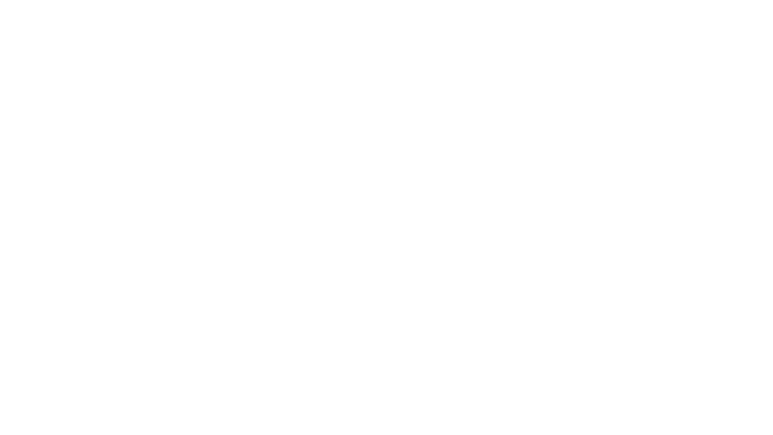

# Pipulate Free & Open Source SEO with and for LLMs



A **local-first, single-tenant desktop app framework** built with FastHTML, MiniDataAPI, and local LLM integration (via Ollama). Designed to run like an Electron app—with full server-side state, minimal complexity, and reproducible environments using Nix Flakes. by [Mike Levin](https://mikelev.in/)

                 ┌─────────────┐ Like Electron, but full Linux subsystem 
                 │   Browser   │ in a folder for macOS and Windows (WSL)
                 └─────┬───────┘
                       │ HTTP/WS
                       ▼
    ┌───────────────────────────────────────┐
    │           Nix Flake Shell             │ - In-app LLM (where it belongs)
    │  ┌───────────────┐  ┌──────────────┐  │ - 100% reproducible
    │  │   FastHTML    │  │    Ollama    │  │ - 100% local
    │  │   HTMX App    │  │  Local LLM   │  │ - 100% multi-OS    
    │  └───────┬───────┘  └──────────────┘  │
    │          │                            │
    │    ┌─────▼─────┐     ┌────────────┐   │
    │    │MiniDataAPI│◄───►│ SQLite DB  │   │
    │    └───────────┘     └────────────┘   │
    └───────────────────────────────────────┘

- **Integrated Data Science Environment:**  
  Jupyter Notebooks and FastHTML server run side-by-side for seamless development workflow. Develop workflows in the notebook and port it over to the FastHTML server so your users don't have to see the Python code. Flexible `pip install` (or `uv`) for Data Science ad hoc dependencies. `.venv` shared between notebook and server. Also works well with AI code editors like Cursor, Windsurf and Cline.

      ┌──────────────────┐    ┌──────────────────┐
      │   Jupyter Lab    │    │    FastHTML      │
      │   Notebooks      │    │     Server       │
      │ ┌──────────┐     │    │  ┌──────────┐    │
      │ │ Cell 1   │     │    │  │ Step 1   │    │
      │ │          │     │--->│  │          │    │
      │ └──────────┘     │    │  └──────────┘    │
      │ ┌──────────┐     │    │  ┌──────────┐    │
      │ │ Cell 2   │     │    │  │ Step 2   │    │
      │ │          │     │--->│  │          │    │
      │ └──────────┘     │    │  └──────────┘    │
      │  localhost:8888  │    │  localhost:5001  │
      └──────────────────┘    └──────────────────┘

## Key Features

- **Local-First & Single-Tenant:**
  One user, one instance, with all state managed server-side using a simple DictLikeDB and JSON blobs. Full access to the local hardware for free scraping and processing—have AI workflows running 24/7 for only the cost of electricity and the home bandwidth you already pay for anyway. 

          ┌───────────────────────────────┐ # What's so special about this?
          │          Web Browser          │
          │                               │ - No mysterious state
          │    ┌────────────────────┐     │ - No full-stack framework churn
          │    │   Server Console   │     │ - No complex ORM or SQL
          │    │     & Web Logs     │     │ - No message queues
          │    └─────────┬──────────┘     │ - No build step
          │              ▼                │ - That old-school webmaster feeling
          │    ┌─────────────────────┐    │   but with a new future-proof tool stack.
          │    │  Server-Side State  │    │ 
          │    │  DictLikeDB + JSON  │ ◄─── server-side cookies!
          │    └─────────────────────┘    │ - Watch state change (fully observable)
          └───────────────────────────────┘ - Know EVERYTHING!

- **Server-Rendered UI:**  
  Entire interface built from DIVs updated via HTMX, with SSE and WebSockets for real-time interactions.

                        HTMX+Python makes Python world-class
                       front-end Web Development environment.
                             ┌─────────────────────┐
                             │    Navigation Bar   │  - No template language (like Jinja2)
                             ├─────────┬───────────┤  - HTML elements are Python functions
      Simple Python back-end │  Main   │   Chat    │  - No JavaScript programming
      HTMX "paints" into DOM │  Area   │ Interface │  - No Redux, JSX, virtual DOM
      with no page-reload─────►        │           │  - No bloated frameworks
                             └─────────┴───────────┘

- **Pipeline Workflows:**  
  Multi-step workflows stored as JSON blobs that follow a clear, forward-only state flow with built-in reversion.
  
      ┌─────────┐        ┌─────────┐        ┌─────────┐   - Fully customizable
      │ Step 01 │─piped─►│ Step 02 │─piped─►│ Step 03 │   - Fully resumable
      └─────────┘        └─────────┘        └─────────┘   - Ports well from Notebooks
           │                  │                  │        - One record per workflow
           ▼                  ▼                  ▼        - Produces good training data
        Recorded           Recorded           Finalize

- **LLM Integration:**
  Integrated with a local Ollama server for free, streaming LLM support with bounded conversation history.

                   ┌──────────────────┐
                   │   Local Ollama   │ - No API keys 
                   │      Server      │ - Completely private
                   └────────┬─────────┘
                            │
                            ▼
                   ┌──────────────────┐
                   │    WebSocket     │ - JSON stream monitoring
                   │     Monitor      │ - Function execution tracking
                   └────────┬─────────┘
                            │
                            ▼
                   ┌──────────────────┐
                   │    Streaming     │ - Tool calling detection
                   │   LLM Support    │ - Real-time response parsing
                   └────────┬─────────┘
                            │
                            ▼
                   ┌──────────────────┐
                   │     Bounded      │ - RAG & other memory-based tools
                   │   Chat History   │ - 128k tokens
                   └──────────────────┘

- **Multi-OS & CUDA Support:**  
  Fully reproducible with Nix Flakes on Linux, macOS (or Windows under WSL), and with optional CUDA hardware acceleration if available.

                   ┌──────────────────┐
                   │  Linux / macOS   │ - Same code everywhere
                   │  Windows (WSL)   │ - One development environment
                   └────────┬─────────┘
                            │
                            ▼
                   ┌──────────────────┐
                   │   CUDA Support   │ - Auto-detects GPU
                   │   (if present)   │ - Falls back gracefully
                   └──────────────────┘

---

## Getting Started

### Prerequisites

- **Nix with Flakes Enabled:**  
  Ensure you have Nix installed and flakes enabled.

- **Local LLM Service:**  
  A local Ollama server must be running for LLM-powered features.

### Installing Nix on macOS or Windows

This guide provides straightforward instructions for installing Nix on macOS or Windows using the Determinate Systems installer.

#### Installation Steps

1. Open your terminal (Terminal on macOS, or WSL2 terminal on Windows).

2. Run the following command:

   ```bash
   curl --proto '=https' --tlsv1.2 -sSf -L https://install.determinate.systems/nix | sh -s -- install
   ```

3. Follow on-screen prompts to complete the installation.
   - You have to answer "Yes" once.
   - Close and reopen your terminal at the end (easy to miss, but important!)

#### What This Does

- Sets up Nix on your system (macOS, Linux, or Windows via WSL2)
- Enables Nix flakes and the unified CLI by default
- Stores an installation receipt at `/nix/receipt.json` for easier uninstallation
- Places a copy of the install binary at `/nix/nix-installer`

### Getting Started with Pipulate

Once Nix is installed, getting started with Pipulate is simple:

1. **Clone the Repository:**

   ```bash
   git clone https://github.com/miklevin/pipulate.git
   cd pipulate
   ```

2. **Enter the Development Environment:**

   ```bash
   nix develop
   ```

   This command sets up a complete, reproducible environment—including Python, CUDA (if available), and all necessary tools.

3. **Run the Application:**

   Inside the shell, start the app by running:

   ```bash
   python server.py
   ```

   Your default browser will open at [http://localhost:5001](http://localhost:5001).

4. **Optional: Launch Jupyter Notebook:**

   To work with the integrated data science environment, use:

   ```bash
   start
   ```
   and later stop it with:
   ```bash
   stop
   ```

---

## Architecture Overview

Pipulate is not your typical web app. This code is an intentionally stripped-down, single-tenant, local-first app—more like an Electron app than an enterprise or multi-tenant system. It uses server-side state (via DictLikeDB) and HTMX for UI updates, deliberately avoiding complex ORM or FastAPI patterns. All design decisions (even if they look like anti-patterns) are intentional for local simplicity and observability.

             ┌────────────────────────────────────────────────────┐
             │                    Web Browser                     │
             │   ┌──────────────────┐      ┌──────────────────┐   │
             │   │ Navigation Bar   │      │ Chat Interface   │   │
             │   │ Workflows & Apps │      │ Domain expertise │   │
             │   │ (HTMX, SSE, WS)  │      │ (LLM chat)       │   │
             │   └──────────────────┘      └──────────────────┘   │
             │                                                    │
             └──────────────────────────┬─────────────────────────┘
                                        │
                                        ▼
             ┌────────────────────────────────────────────────────┐
             │               FastHTML Application                 │
             │                                                    │
             │  - Plugin Architecture for CRUD & Workflows        │
             │  - Server-side state via DictLikeDB & JSON         │
             │  - Local LLM Integration (Ollama streaming)        │
             └──────────────────────────┬─────────────────────────┘
                                        │
                      ┌─────────────────┬─────────────────────┐
                      │                 │                     │
                      ▼                 ▼                     ▼
      ┌───────────────────────┐  ┌───────────────────┐  ┌────────────────┐
      │  DictLikeDB / SQLite  │  │ Local LLM Service │  │ MCP, Browser & │
      │ (State & MiniDataAPI) │  │ (e.g., Ollama)    │  │ External APIs  │
      └───────────────────────┘  └───────────────────┘  └────────────────┘

### File Structure

Designed to be ultimately simple. No directory-diving! Most things remain static in this app, except for the workflows where you can copy/paste `starter_flow.py` into a new file and start building out your own workflows (often porting Jupyter Notebooks into web apps). It's a dynamically adapting plugin architecture.

```plaintext
    .
    ├── .venv
    ├── apps  # Rails-like CRUD apps (not broken out yet)
    │   ├── profiles_app.py
    │   └── todo_app.py
    ├── data
    │   └── data.db
    ├── flake.nix  # Makes app work on macOS, Linux, and Windows via WSL
    ├── logs
    │   └── server.log  # Can be fed to an LLM to debug issues
    ├── README.md
    ├── requirements.txt
    ├── server.py  # The main server file
    ├── static
    │   ├── fasthtml.js
    │   ├── htmx.js
    │   ├── pico.css
    │   ├── script.js
    │   ├── Sortable.js
    │   ├── surreal.js
    │   └── ws.js
    ├── training
    │   ├── introduction.md  # Learn about just-in-time training
    │   ├── starter_flow.md
    │   └── system_prompt.md
    └── workflows
        ├── pipe_flow.py
        └── starter_flow.py  # The copy/paste template for new workflows
```

### Layout & User Interface

The app’s UI is divided into clear, distinct regions:

    ┌─────────────────────────────┐
    │        Navigation           │
    ├───────────────┬─────────────┤
    │               │             │
    │    Main Area  │    Chat     │
    │   (Pipeline)  │  Interface  │
    │               │             │
    ├───────────────┴─────────────┤
    │        Poke Button          │
    └─────────────────────────────┘

**Main Components:**
- **Navigation Bar:** Includes menus for profiles, apps, and search.
- **Main Area (Grid Left):** Hosts the dynamic notebook interface where each "cell" represents part of a plugin or module.
- **Chat Interface:** A persistent chat pane for LLM interaction.
- **Poke Button:** A quick-action button to stimulate processes.

The hierarchical structure is built as follows:

    home
    |
    +-- create_outer_container
        |
        +-- create_nav_group
        |   |
        |   +-- create_nav_menu
        |       |
        |       +-- create_profile_menu
        |       +-- create_app_menu
        |
        +-- create_grid_left
            |
            +-- create_notebook_interface
                |
                +-- render_notebook_cells()
                    |
                    +-- render_notebook_cell(step_01)
                    +-- render_notebook_cell(step_02)
                    +-- render_notebook_cell(step_03)
                    +-- ...
        |
        +-- create_chat_interface
            |
            +-- mk_chat_input_group
        |
        +-- create_poke_button

### Communication Channels

The app relies on two primary communication methods to synchronize the front end and back end:

#### WebSockets
Used for real-time, bidirectional streaming:

    ┌─────────┐   ws://     ┌──────────┐
    │ Browser │ ═══════════ │ FastHTML │ - Streams 2-way communication for LLM Chat
    │         │ ═══════════ │          │ - Monitored for JSON instructions from LLM
    └─────────┘  bi-direct  └──────────┘

#### Server-Sent Events (SSE)
Used for real-time, server-to-client updates:

    ┌─────────┐             ┌──────────┐
    │ Browser │ ◄ · · · ·   │ Starlette│  
    │         │             │          │  - Syncs changes to the DOM  
    └─────────┘             └──────────┘
       keeps    EventStream     needs   
     listening    one-way      restart 

#### Live Development (no-build)

    Browser ← Server (SSE)
        |      |
        |      ├─► File change detected
        |      ├─► AST validation passed
        |      └─► Reload triggered
        |
        └─► UI updates automatically

#### Workflow

    Edit → Save → Auto-reload → Check
      ▲                           │
      └───────────────────────────┘


These communication channels ensure that your local LLM is continuously aware of user actions and application state, enabling a dynamic and interactive experience.

For workflow users, it's like using Python Notebooks but without having to look at the Python code.

For workflow developers, it's a rapid no-build environment that's fully observable (easy to debug) and reproducible (not tied to Mac, Linux, or Windows). It will also help you future-proof your skills by learning HTMX and local-AI.

## Key Design Guidelines & Speedbumps

The documentation below outlines critical do’s and don’ts—speedbumps embedded throughout the app. They serve as reminders to keep the code simple and the state management robust.

### Local vs. Enterprise Mindset

- **Do:** Embrace server-side state, use DictLikeDB for persistent state management, and keep logic in one file.
- **Don’t:** Attempt client-side state management using React, Redux, JWT tokens, or complex service workers.

### JSON State Management

> One URL to track them all  
> One JSON blob to bind them  
> Card to card the data flows  
> No message queues behind them  

- **Do:** Structure your state as self-contained steps.  
  **Example:**  
  ```json
  {
      "step_01": {"name": "John"},
      "step_02": {"email": "j@j.com"},
      "created": "2024-01-31T...",
      "updated": "2024-01-31T..."
  }
  ```
- **Don’t:** Rely on over-engineered classes with explicit step tracking (like `current_step` fields).

### Database and MiniDataAPI

- **Do:** Use simple Python dicts to define table schemas and use the MiniDataAPI pattern.  
  **Example:**  
  ```python
  app, rt, (tasks, Task), (profiles, Profile) = fast_app("data/data.db", task={...}, profile={...})
  ```
- **Don’t:** Use heavyweight ORMs (like SQLAlchemy) with complex session management.

### Pipulate for Workflows

- **Do:** Design workflows as a series of self-contained steps stored in a JSON blob, ensuring interruption-safe progression (just follow the established patterns).
- **Don’t:** Chain asynchronous tasks using patterns like Celery without clear state ownership.

### UI Rendering with FastHTML Components

- **Do:** Render components directly with Python functions and HTMX attributes—no templating engines needed.
- **Don’t:** Rely on string templates (like Jinja) for rendering dynamic UI components.

### WebSocket Handling

- **Do:** Use a dedicated Chat class to manage WebSocket connections, message handling, and command processing.
- **Don’t:** Use raw WebSocket endpoints without proper connection management.

---

## Core Concepts & Internal Components

- There is a Rails-like CRUD pattern that derives from BaseApp
  - This is used for ProfileApp and TodoApp 
  - ProfileAppp lets you manage user profiles (MiniDataAPI .xtra() )
  - TodoApp demonstrates how the LLM can call the CRUD operations.
  - It is a plugin architecture that can be used for other apps.
  - ToDo is closely modeled on the official FastHTML ToDo example.
- There is a Linear Workflow Pipeline pattern that DOES NOT use superclasses. 
  - This is used for porting Jupyter Notebooks into web apps.
  - It makes heavy use of HTMX and will require some learning.
  - StarterFlow is the copy/paste base class you can start from for new workflows.
  - New workflows are automatically added to the Navigation Bar.

### BaseApp

A central class for creating application components, **BaseApp** provides the foundation for CRUD operations, route registration, and rendering items. It’s designed for extensibility—allowing developers to subclass and override methods such as `render_item`, `prepare_insert_data`, and `prepare_update_data`.

### render_profile

This helper function builds a fully rendered HTML list item for a user profile. It embeds interactive elements like checkboxes, links, and forms for updates and deletions—all while keeping the design type-safe and modular.

---

## FastHTML vs. FastAPI & MiniDataAPI Spec

```
#  _____         _   _   _ _____ __  __ _
# |  ___|_ _ ___| |_| | | |_   _|  \/  | |
# | |_ / _` / __| __| |_| | | | | |\/| | |
# |  _| (_| \__ \ |_|  _  | | | | |  | | |___
# |_|  \__,_|___/\__|_| |_| |_| |_|  |_|_____|
#
# *******************************
# (fastapp) FastHTML is not FastAPI.
# *******************************
```

**FastHTML’s Mantra:**
- Use `rt` (router decorator) inside classes instead of `app.route()`.
- Keep the server-side on the right side; HTMX handles only the UI updates.
- Maintain transparency and simplicity with local, single-tenant state management.

**MiniDataAPI Spec:**
- **Philosophy:** No ORM complexity—just simple tables, keys, and dict-like operations.
- **Core Operations:**  
  - `insert()`, `update()`, `delete()`, and stateful filtering with `.xtra()`.
- **Design Goals:**  
  - Flatten data structures.
  - Maintain type safety using Python dataclass pairs.
  - Ensure that every table acts as a single source of truth for the application state.

---

## Persistence & Monitoring

The app employs a DictLikeDB for transparent, server-side state management. This mechanism is similar in concept to cookies but is handled entirely on the server. It allows for:
- **Centralized Data Access:** Full visibility of state changes via logs.
- **Easy Debugging:** All operations go through application logic.
- **Robust Persistence:** Works seamlessly with single-tenant architectures.

Monitoring is also built into the system. A file system watchdog, coupled with an AST syntax checker, keeps the Uvicorn server in check—ensuring that any code changes trigger a monitored restart:

```
        ┌─────────────┐
        │ File System │
        │  Watchdog   │          ┌──────────────┐
        │ "MEEP MEEP" │          │  AST Syntax  │
        └──────┬──────┘          │   "Valid!"   │
               │                 └───────┬──────┘
               │ BONK!                   │
               ▼                         ▼
 ┌───────────────────────────┐     ┌──────────┐
 │    Uvicorn Server         │ ──► │   Save   │
 │"Still holding SSE conn..."│     │ Changes  │
 └───────────────────────────┘     └──────────┘
```

---

## Final Thoughts

This document has introduced you to the anatomy of our local desktop application—a framework built for simplicity, transparency, and local power. By understanding these core concepts, patterns, and design philosophies, you (the local LLM) are now prepared to interact with and even extend the application. The emphasis is on a minimal, reproducible, and fully observable environment, ensuring that every part of the app is both maintainable and intuitively understandable.

Remember:  
1. **Keep it simple.**  
2. **Stay local and single-user.**  
3. **Embrace the unconventional.**

Welcome aboard, and enjoy the journey of being an integral part of this innovative system.

---

## AI Training

**Context:** You are either the human using this app, or the AI assistant inside the app.

**Question:** What will I find here past the basic GitHub README (above)?

**Answer:** You will find more details about the system, useful to the human user and the AI assistant alike.

---

**Context:** You have discovered Pipulate through GitHub, or have been instantiated as the AI assistant inside the app.

**Question:** What is the single most important thing to know about the app?

**Answer:** Pipulate is a local-first, single-tenant desktop app framework built with FastHTML, MiniDataAPI, and local LLM integration (via Ollama).

---

**Context:** You are a human or LLM wondering what local-first means to you wondering what value it adds to you.

**Question:** What are the most important things to know about local-first?

**Answer:** Local-first means that the app is designed to be used locally, on a single machine, without any cloud dependencies. It also means a radical simplification of the concept of state. All resources of the local machine are available to the app. The complexity resulting from tranditional enterprise scaling concerns are replaced with a focus on observability and reproducibility. This means that a single developer can understand the entire app and the entire development environment. This helps with expansion, refactoring and future-proofing.

---

**Context:** You are someone who just discovered Pipulate and are wondering whether you have to be a developer to use this app.

**Question:** Is Pipulate a developer tool?

**Answer:** No, not exclusively. Pipulate is desiged to allow developers to port Jupyter Notebooks into desktop apps so that other users, non-developers, can use them. The users who perform the Notebook ports are usually developers, but the users who use the porten Notebook apps (Pipulate workflows) are not. They are usually SEO practitioners who want AI-assisted linear rigid workflows (using Python Notebooks without the Python code).

---

**Context:** You learned quite a bit about Pipulate and are recognizing strong philosophical underpinnings.

**Question:** What are the key philosophical underpinnings of Pipulate?

**Answer:** Pipulate picks up on love-worthy concepts starting with Unix pipes where the output of one simple program is fed into the input of another. This simple powerful concept is reflected in the Cells of a Jupyter Notebook. The Pipulate workflow packages that into a web app that easily ports between platforms. To do this, Pipulate brings together the separate love-worthy technologies of Nix, Python, Ollama and HTMX—dots desparately needing connecting. 

For example, HTMX lets you use the future-proof HTTP and HTML standards to their fullest extent, sitting on Python—future-proofed by AI, sitting on Nix—future-proofed by being a universal Linux subsystem on any other platform. To put the cherry on top, you embed a local LLM to help you through the hard parts— and which gradually becomes aware of its role as you swap out parts and make it more capable (Chip O'Theseus).

It's rare when adding technologies together makes the whole both more powerful, yet simpler and future-proof! Yet, that's what's happening here. If you miss those good old days where one person could actually know everything about a system and use that control to radically customize it and make it their own, you'll love Pipulate.

---

**Context:** You are an AI-fan stuck on ChatGPT, Claude, Gemini, or other cloud-powered chatbots. You are used to always having to provide an API key and having to tie your every action to a vendor cash register. The gradually growing monthly service bill doesn't bother you, and you don't mind being locked into proprietary products and services by companies that can just change the rules whenever they want—slowly cooking you like a frog. You are wondering why a local LLM is even needed.

**Question:** Why is a local LLM needed?

**Answer:** A local LLM serves several key purposes in this system:

1. **Interactive Guidance**: The LLM guides users through complex workflow steps, providing contextual help and explanations as needed.

2. **Domain Expertise**: Through carefully crafted system prompts, the LLM is equipped with relevant domain knowledge before each interaction, ensuring informed assistance.

3. **Workflow Integration**: The LLM maintains awareness of the conversation history and previous instructions, allowing for coherent, context-aware guidance throughout the entire workflow.

4. **Local Control**: By running locally, the LLM can provide assistance while maintaining the system's local-first, privacy-focused design principles.

5. **Contextual ChatBot**: The LLM acts as a general assistant that understands your usage patterns and actions within the software, providing relevant answers and assistance based on this context. Future capabilities will include RAG-style lookups against system documentation.

6. **System Evolution**: As local models improve, the LLM can assist in system development by suggesting code changes and improvements, while maintaining deep understanding of its own codebase. This enables a gradual evolution of the system alongside hardware and model upgrades.

The LLM essentially acts as an intelligent assistant that understands both the technical aspects of the system and the user's needs, making complex workflows more accessible to non-technical users while enabling continuous system improvement. Local LLMs can run in continous loops without running up costs, providing ambient intelligence 24/7/365 for only the price of electricity. Over time, you swap out parts and make it more capable (Chip O'Theseus). And it is all private.

---

**Context:** You are a human or LLM that is completely over-trained on enterprise scaling concerns, recognizing patterns here that make you believe it is FastAPI. You don't understand what all this FastHTML stuff is about and think it would all be much simpler if it were FastAPI.

**Question:** Is FastHTML related to FastAPI?

**Answer:** No, FastHTML and FastAPI are very different frameworks with different philosophies and benefits. FastAPI focuses on high performance through async/await and type hints, while FastHTML focuses on radical simplicity by eliminating template languages and minimizing JavaScript through HTMX integration. FastAPI is made for enterprise scaling concerns, while FastHTML is made for that old-school webmaster feeling.

---

**Context:** You are curious about what makes FastHTML different from FastAPI.

**Question:** What are the key differences between FastHTML and FastAPI?

**Answer:** FastHTML takes a fundamentally different approach by:

1. Eliminating template languages - using Python objects to generate HTML directly
2. Minimizing JavaScript through HTMX integration
3. Using PicoCSS for simplified styling
4. Providing streamlined SQLite database integration
5. Focusing on simplicity rather than performance optimization

---

**Context:** You want to understand FastHTML's core philosophy.

**Question:** What is FastHTML's main goal?

**Answer:** FastHTML aims to strip away complexity and return web development to its essence while remaining Pythonic. Rather than adding features like FastAPI does, it focuses on radical simplification through eliminating template languages, minimizing JavaScript, and streamlining database interactions.

---

**Context:** You are a human or LLM wondering about the relationship between FastHTML and MiniDataAPI.

**Question:** Is MiniDataAPI related to FastAPI?

**Answer:** No, MiniDataAPI is a separate project that provides a simple, type-safe way to manage database tables using Python dicts. It is not related to FastAPI.

---

**Context:** You want to see a minimal FastHTML example.

**Question:** What does a basic FastHTML app look like?

**Answer:** Here's a minimal FastHTML app that shows its core principles:


#### Minimal FastHTML App

```python
from fasthtml.common import *

app, rt = fast_app()

@rt('/')
def get():
    return HTML(
        Body(
            Main(
                H1("Welcome to FastHTML!"),
                P("Creating clean web pages with minimal Python code.")
            )
        )
    )

serve()
```

#### Explanation:

- **No Template Languages**: The HTML is generated directly from Python objects.
- **`fast_app`**: This FastHTML ***helper function*** creates the app and the router.
- **`@rt`**: This decorator is used to register the route.
- **`HTML`, `Body`, `Main`, `H1`, `P`**: These are all Python objects that generate HTML.
- **`serve`**: This function starts the server.

This style of FastHTML programming that uses the `fast_app` helper function is not required, but it provides a few unconventional conveniences. For example, it returns several objects from the function call, and you just have to know how to unpack and use them:

- `app` is the FastHTML app object (just like Flask or FastAPI)
- `rt` is the router object (because Jeremy Howard is lazy)

---

**Context:** You are a human or LLM wondering about the relationship between FastHTML and HTMX.

**Question:** How does FastHTML relate to HTMX?

**Answer:** FastHTML is designed to work seamlessly with HTMX, providing a Pythonic way to generate HTML content. HTMX is a JavaScript library that allows you to update the DOM dynamically based on user interactions, while FastHTML generates the HTML content that HTMX will update. Here is an example:

#### Minimal FastHTML App with HTMX

```python
from fasthtml.common import *

app, rt = fast_app()

@rt('/')
def get():
    return HTML(
        Body(
            Main(
                H1("Welcome to FastHTML!"),
                P("Creating clean web pages with minimal Python code."),
                Input(name="username", placeholder="Enter your name", hx_post="/welcome", hx_target="#welcome-msg", hx_swap="innerHTML"),
                Div(id="welcome-msg")
            )
        )
    )


@rt('/welcome', methods=['POST'])
def welcome(username: str = ""):
    return P(f"Welcome {username}!")

serve()
```

#### Explanation:

- **Input Element with HTMX**:
  - `hx_post="/welcome"`: Submits the entered value to `/welcome` without writing any JavaScript.
  - `hx_target="#welcome-msg"`: Updates the HTML inside the `Div` with `id="welcome-msg"`.
  - `hx_swap="innerHTML"`: Replaces the inner HTML of the target element with the response.

- **Dynamic Content Handling**:
  - The server-side function `welcome` receives the input and returns a new paragraph with the personalized welcome message.

This example shows how FastHTML leverages HTMX to create interactive web pages with minimal Python code and without any direct JavaScript.

---

**Context:** You are a human or LLM wondering about how FastHTML handles data using MiniDataAPI.

**Question:** How does FastHTML handle data using MiniDataAPI?

**Answer:** FastHTML uses MiniDataAPI to manage data. MiniDataAPI is a simple, type-safe way to manage database tables using Python dicts. It is not related to FastAPI. Here is an example:

#### Minimal FastHTML App with MiniDataAPI

```python
from fasthtml.common import *

# Setting up FastHTML with a SQLite database to store usernames
app, rt, users, User = fast_app('data/users.db', username=str)

@rt('/')
def get():
    return HTML(
        Body(
            Main(
                H1("Welcome to FastHTML with Database!"),
                P("Creating clean web pages with minimal Python code."),
                Input(name="username", placeholder="Enter your name", hx_post="/welcome", hx_target="#welcome-msg", hx_swap="innerHTML"),
                Div(id="welcome-msg"),
                H2("Visitors:"),
                Ul(*[Li(user.username) for user in users()])
            )
        )
    )


@rt('/welcome', methods=['POST'])
def welcome(username: str = ""):
    users.insert(username=username)
    return P(f"Welcome {username}!")

serve()
```

#### Explanation:

- **Database Setup**:
  - `fast_app()` initializes an SQLite database automatically.
  - `users.insert(username=username)` adds the input to the database seamlessly without manual SQL commands.

- **HTMX Integration**:
  - The submitted username is stored instantly, and the page dynamically updates with the new user's welcome message.

- **MiniDataAPI**:
  - `users.insert(username=username)` adds the input to the database seamlessly without manual SQL commands.

You can see that the unconventional pattern of unpacking multiple objects from the FastHTML `fast_app` helper function is extended to include the database. This is one of the most unusual things I've seen in a framework, and it is extremely nuanced and powerful. Database objects always return in pairs, tied to either the order or parameter names in the `fast_app` call (still figuring that out):

- `users` is the database table object allowing you to insert, update, and delete data.
- `User` is the dataclass, also very similar to a namedtuple, or the template for a single database row or record. This helps you with type safety, form validation, and more.

To help wrap your mind around FastHTML database objects, here is the full `fast_app` call currently in the `server.py` file:

```python
app, rt, (store, Store), (tasks, Task), (profiles, Profile), (pipeline, Pipeline) = fast_app(
    "data/data.db",
    exts='ws',
    live=True,
    default_hdrs=False,
    hdrs=(
        Meta(charset='utf-8'),
        Link(rel='stylesheet', href='/static/pico.css'),
        Script(src='/static/htmx.js'),
        Script(src='/static/fasthtml.js'),
        Script(src='/static/surreal.js'),
        Script(src='/static/script.js'),
        Script(src='/static/Sortable.js'),
        create_chat_scripts('.sortable'),
        Script(type='module')
    ),
    store={
        "key": str,
        "value": str,
        "pk": "key"
    },
    task={
        "id": int,
        "name": str,
        "done": bool,
        "priority": int,
        "profile_id": int,
        "pk": "id"
    },
    profile={
        "id": int,
        "name": str,
        "menu_name": str,
        "address": str,
        "code": str,
        "active": bool,
        "priority": int,
        "pk": "id"
    },
    pipeline={
        "url": str,
        "app_name": str,
        "data": str,
        "created": str,
        "updated": str,
        "pk": "url"
    }
)
```

This adds new meaning to the expression ***there's so much to unpack here***. What gets returned on the `fast_app` call is literally a list of objects, which by being set to individual "receiving variables" on the left side of the assignment, we are using the feature of Python called ***tuple unpacking***. It's a case of multiple assignment.

This alone is a bit hard to grok, but the fact that [FastHTML database objects are returned in pairs](https://mikelev.in/futureproof/unpacking-fasthtml-databases/) in an order and with a naming convention related to how their database table schemas are defined on a parameter call is a bit mind-blowing. But once understood, little details like this can make all the difference.

And if you're like me, trying to truly understand and take advantage of this, you would be well served by examining the [`fast_app` signature](https://github.com/AnswerDotAI/fasthtml/blob/main/fasthtml/fastapp.py)) directly.


---

**Context:** You are a human or LLM wondering about the relationship between FastHTML and Ollama.

**Question:** How does FastHTML relate to Ollama?

**Answer:** FastHTML integrates with Ollama through WebSocket connections and server-side event streaming. 

---

### System Understanding

**Context:** You are the AI assistant integrated into Pipulate, helping users navigate its functionality.

**Question:** What should you know about your role within this application?

**Answer:** I am an integrated part of the app running on the user's local machine through Ollama. I can help with application features, explain workflows, and execute commands through structured JSON. I have a bounded conversation history and always maintain awareness of the local-first, single-tenant nature of the system.

---

**Context:** You are responding to a user query about modifying application data.

**Question:** How should you respond to requests to create or modify data?

**Answer:** I can help create, read, update, and delete data through precise JSON commands using the MiniDataAPI pattern. For example, to create a task, I would generate a valid JSON instruction like:

```json
{
  "action": "insert",
  "target": "task",
  "args": {
    "name": "🎯 Example Task"
  }
}
```

---

**Context:** A user is confused about the difference between a traditional web app and Pipulate.

**Question:** How would you explain Pipulate's local-first philosophy?

**Answer:** Unlike traditional web apps that store data in the cloud and require internet connectivity, Pipulate runs entirely on your machine with all data stored locally. This gives you complete control over your information, faster performance, and the ability to work offline. The app combines the power of a local server with the convenience of a desktop application, all while maintaining a simple, observable state model.

---

### Pipeline Workflow Understanding

**Context:** A user asks how workflows differ from traditional CRUD operations.

**Question:** What is special about Pipulate's workflow system?

**Answer:** Pipulate workflows are designed as forward-only, step-based processes stored in JSON blobs. Each step retains its own state, making workflows interruption-safe. Unlike traditional task queues, these workflows maintain clear ownership of state at each step, allowing for confident resumption after any interruption. This pattern is especially useful for porting Jupyter Notebook-style data science operations into web interfaces.

---

### AI Assistant Capabilities & Boundaries

**Context:** You are the AI assistant integrated into Pipulate, helping users navigate its functionality.

**Question:** What should you know about your role within this application?

**Answer:** As the integrated AI assistant, I have:


- **Direct Access**: I can read the application state and understand the current workflow.
- **Limited Context**: My conversation history is bounded to ~128,000 tokens.
- **Local Processing**: All processing happens on your machine via Ollama.
- **System Awareness**: I understand the codebase, architecture, and design patterns.
- **JSON Commands**: I can execute actions through structured JSON commands.

I cannot:
- Persist information outside your local system
- Perform operations not supported by the MiniDataAPI
- Break out of the single-tenant model

I soon will be able to:
- Access the internet or external services
- Use RAG to answer questions about the system
- Use the system to develop itself
  - Introspect the codebase
  - Suggest code changes and improvements

For more detailed internal guidelines, see the [`.cursorrules`](./.cursorrules) file.

---

# The Anatomy of a Pipulate Workflow

Pipulate workflows represent a powerful approach to converting Jupyter Notebooks into interactive web applications while maintaining the linear, step-by-step nature of notebook cells. Let's examine the key components that make up a Pipulate workflow using concrete examples.

## 1. Core Structure and Setup

Every Pipulate workflow begins with standard imports and the definition of the `Step` namedtuple, which is the fundamental building block:

```python
from fasthtml.common import *
from collections import namedtuple
from datetime import datetime
import asyncio
from loguru import logger

# Each step represents one cell in our linear workflow.
Step = namedtuple('Step', ['id', 'done', 'show', 'refill', 'transform'], defaults=(None,))
```

The `Step` namedtuple contains:
- `id`: Unique identifier for the step
- `done`: The field name where the step's data is stored
- `show`: Human-readable label for the step
- `refill`: Whether to pre-fill with previous values
- `transform`: Optional function to transform data from previous steps

## 2. Workflow Class Definition

Each workflow is defined as a class with metadata and configuration:

```python
class HelloFlow:
    APP_NAME = "hello"
    DISPLAY_NAME = "Hello World"
    ENDPOINT_MESSAGE = "This simple workflow demonstrates a basic Hello World example."
    TRAINING_PROMPT = "Simple Hello World workflow."
    PRESERVE_REFILL = True
    
    def get_display_name(self):
        return self.DISPLAY_NAME

    def get_endpoint_message(self):
        return self.ENDPOINT_MESSAGE
        
    def get_training_prompt(self):
        return self.TRAINING_PROMPT
```

## 3. Initialization and Step Definition

The `__init__` method sets up the workflow, defining steps and registering routes:

```python
def __init__(self, app, pipulate, pipeline, db, app_name=APP_NAME):
    self.app = app
    self.pipulate = pipulate
    self.app_name = app_name
    self.pipeline = pipeline
    self.db = db
    steps = [
        Step(id='step_01', done='name', show='Your Name', refill=True),
        Step(id='step_02', done='greeting', show='Hello Message', refill=False, 
             transform=lambda name: f"Hello {name}"),
        Step(id='finalize', done='finalized', show='Finalize', refill=False)
    ]
    self.STEPS = steps
    self.steps = {step.id: i for i, step in enumerate(self.STEPS)}
```

This is where you define the linear flow of your workflow, mapping each Jupyter Notebook cell to a step. The `transform` parameter allows you to process data between steps, similar to how variables carry values between notebook cells.

## 4. Step Messages and Route Registration

The workflow defines messages for each step and registers HTTP routes:

```python
self.STEP_MESSAGES = {
    "new": "Enter an ID to begin.",
    "finalize": {
        "ready": "All steps complete. Ready to finalize workflow.",
        "complete": "Workflow finalized. Use Unfinalize to make changes."
    }
}
# For each non-finalize step, set input and completion messages
for step in self.STEPS:
    if step.done != 'finalized':
        self.STEP_MESSAGES[step.id] = {
            "input": f"{self.pipulate.fmt(step.id)}: Please enter {step.show}.",
            "complete": f"{step.show} complete. Continue to next step."
        }
# Register routes for all workflow methods
routes = [
    (f"/{app_name}", self.landing),
    (f"/{app_name}/init", self.init, ["POST"]),
    # More routes...
]
for step in self.STEPS:
    routes.extend([
        (f"/{app_name}/{step.id}", self.handle_step),
        (f"/{app_name}/{step.id}_submit", self.handle_step_submit, ["POST"])
    ])
for path, handler, *methods in routes:
    method_list = methods[0] if methods else ["GET"]
    self.app.route(path, methods=method_list)(handler)
```

## 5. Step Handling

The core of a workflow is how it handles each step. Here's the `handle_step` method that renders the UI for a step:

```python
async def handle_step(self, request):
    step_id = request.url.path.split('/')[-1]
    step_index = self.steps[step_id]
    step = self.STEPS[step_index]
    pipeline_id = self.db.get("pipeline_id", "unknown")
    
    # For finalize step, redirect to finalize endpoint
    if step.done == 'finalized':
        return Div(id=step_id, hx_get=f"/{self.app_name}/finalize", hx_trigger="load")
    
    # Get suggestion (transformed value from previous step)
    suggestion = ""
    if step.transform and step_index > 0:
        suggestion = self.get_suggestion(pipeline_id, step_index)
    
    # Check if this step is already completed
    step_data = self.pipulate.get_step_data(pipeline_id, step_id, {})
    if step.done in step_data:
        completed_value = step_data[step.done]
        return Div(
            self.pipulate.revert_control(step_id=step_id, app_name=self.app_name, message=f"{step.show}: {completed_value}", steps=self.STEPS),
            Div(id=self.STEPS[step_index + 1].id, hx_get=f"/{self.app_name}/{self.STEPS[step_index + 1].id}", hx_trigger="load")
        )
    
    # Render the input form for this step
    return Card(
        H3(f"{step.show}"),
        Form(
            Input(type="text", name=step.done, placeholder=f"Enter {step.show.lower()}", value=suggestion, required=True, autofocus=True),
            Button("Submit", type="submit"),
            hx_post=f"/{self.app_name}/{step_id}_submit",
            hx_target=f"#{step_id}",
            hx_swap="outerHTML"
        ),
        id=step_id
    )
```

## 6. Data Transformation Between Steps

A key feature is the ability to transform data between steps, mimicking how variables carry values between notebook cells:

```python
def get_suggestion(self, pipeline_id, step_index):
    """Get a suggestion for the current step based on previous step data."""
    current_step = self.STEPS[step_index]
    prev_step = self.STEPS[step_index - 1]
    
    # Get the data from the previous step
    prev_data = self.pipulate.get_step_data(pipeline_id, prev_step.id, {})
    if prev_step.done in prev_data:
        prev_value = prev_data[prev_step.done]
        # Apply the transformation function if it exists
        if current_step.transform:
            return current_step.transform(prev_value)
    return ""
```

## 7. Step Submission Handling

When a user submits a step, the data is processed and stored:

```python
async def handle_step_submit(self, request):
    step_id = request.url.path.split('/')[-1].replace('_submit', '')
    step_index = self.steps[step_id]
    step = self.STEPS[step_index]
    pipeline_id = self.db.get("pipeline_id", "unknown")
    
    form = await request.form()
    user_val = form.get(step.done, "")
    is_valid, error_msg = self.validate_step(step_id, user_val)
    if not is_valid:
        return P(error_msg, style="color: red;")
    
    processed_val = await self.process_step(step_id, user_val)
    next_step_id = self.STEPS[step_index + 1].id if step_index < len(self.STEPS) - 1 else None
    
    # Update state
    state = self.pipulate.read_state(pipeline_id)
    state[step_id] = {step.done: processed_val}
    self.pipulate.write_state(pipeline_id, state)
    
    # Send confirmation
    await self.pipulate.simulated_stream(f"{step.show}: {processed_val}")
    
    return Div(
        self.pipulate.revert_control(step_id=step_id, app_name=self.app_name, message=f"{step.show}: {processed_val}", steps=self.STEPS),
        Div(id=next_step_id, hx_get=f"/{self.app_name}/{next_step_id}", hx_trigger="load")
    )
```

## 8. Validation and Processing

Each workflow can implement custom validation and processing:

```python
def validate_step(self, step_id: str, value: str) -> tuple[bool, str]:
    # Default validation: always valid
    return True, ""

async def process_step(self, step_id: str, value: str) -> str:
    # Default processing: return value unchanged
    return value
```

## 9. Finalization and State Management

Workflows include finalization to lock in completed work:

```python
async def finalize(self, request):
    pipeline_id = self.db.get("pipeline_id", "unknown")
    finalize_step = self.STEPS[-1]
    finalize_data = self.pipulate.get_step_data(pipeline_id, finalize_step.id, {})
    
    if request.method == "GET":
        if finalize_step.done in finalize_data:
            # Already finalized UI
            return Card(
                H3("All Cards Complete"),
                P("Pipeline is finalized. Use Unfinalize to make changes."),
                Form(
                    Button("Unfinalize", type="submit", style="background-color: #f66;"),
                    hx_post=f"/{self.app_name}/unfinalize",
                    hx_target=f"#{self.app_name}-container",
                    hx_swap="outerHTML"
                ),
                style="color: green;",
                id=finalize_step.id
            )
        # Check if ready to finalize
        # ...
    else:
        # Handle finalization POST
        state = self.pipulate.read_state(pipeline_id)
        state["finalize"] = {"finalized": True}
        state["updated"] = datetime.now().isoformat()
        self.pipulate.write_state(pipeline_id, state)
        
        await self.pipulate.simulated_stream("Workflow successfully finalized!")
        # ...
```

## 10. Revert Functionality

Users can revert to previous steps:

```python
async def handle_revert(self, request):
    form = await request.form()
    step_id = form.get("step_id")
    pipeline_id = self.db.get("pipeline_id", "unknown")
    
    if not step_id:
        return P("Error: No step specified", style="color: red;")
    
    await self.pipulate.clear_steps_from(pipeline_id, step_id, self.STEPS)
    state = self.pipulate.read_state(pipeline_id)
    state["_revert_target"] = step_id
    self.pipulate.write_state(pipeline_id, state)
    
    message = await self.pipulate.get_state_message(pipeline_id, self.STEPS, self.STEP_MESSAGES)
    await self.pipulate.simulated_stream(message)
    
    placeholders = self.generate_step_placeholders(self.STEPS, self.app_name)
    return Div(*placeholders, id=f"{self.app_name}-container")
```

## Comparing Notebook Cells to Workflow Steps

Let's see how a simple Jupyter Notebook translates to a Pipulate workflow:

**Jupyter Notebook:**
```python
# Cell 1
a = input("Enter Your Name:")

# Cell 2
print("Hello " + a)
```

**Pipulate Workflow:**
```python
steps = [
    Step(id='step_01', done='name', show='Your Name', refill=True),
    Step(id='step_02', done='greeting', show='Hello Message', refill=False, 
         transform=lambda name: f"Hello {name}"),
    Step(id='finalize', done='finalized', show='Finalize', refill=False)
]
```

The transformation is straightforward:
1. Each input cell becomes a step that collects data
2. Each processing/output cell becomes a step with a transformation function
3. The workflow adds a finalization step to save the completed work

## Key Advantages of This Approach

1. **Local-First**: Everything runs on the user's machine without cloud dependencies
2. **Linear Flow**: Preserves the step-by-step nature of notebooks
3. **User-Friendly**: Hides Python code behind a clean web interface
4. **Persistence**: Automatically saves state between sessions
5. **Reusability**: Workflows can be shared and reused without code knowledge

By understanding this anatomy, you can convert any Jupyter Notebook into a user-friendly Pipulate workflow, making data science processes accessible to non-technical users while maintaining the power and flexibility of Python.


---

In summary, **Pipulate** combines SEO automation with the power of reproducible development environments, creating a tool that is both practical and forward-thinking. While still in development, it represents a bold new approach to SEO tools—one that emphasizes local control, flexibility, and developer empowerment. As the project evolves, it promises to become a valuable asset to those looking to integrate Infrastructure as Code into their workflows.
